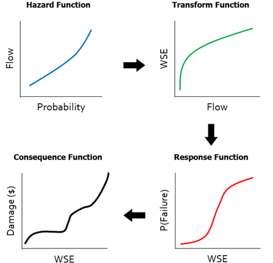

# Risk Analysis Framework

In RMC-TotalRisk, a risk analysis computes the risk associated with a collection of potential failure modes for each system component. A failure mode consists of three key inputs: a hazard, the system’s response to the hazard, and the consequences of that response. A non-failure mode, on the other hand, includes the hazard and the associated non-failure consequences.

A risk analysis uses four types of functions as inputs:

- **Hazard Function**: Commonly called a frequency curve, this function describes the exceedance probabilities of various hazard levels. Examples include annual maximum peak flow frequency, peak reservoir pool stage frequency, and peak ground acceleration.

- **Transform Function**: This function converts hazard levels from one type to another. For example, a peak flow-frequency function can be transformed into a stage-frequency function using a flow-to-stage rating curve. Transform functions are optional.

- **System Response Function**: Often referred to as a fragility curve, this function defines the conditional probability of failure for various hazard levels, such as water surface elevations (WSEs). The system response function specifies the failure mode.

- **Consequence Function**: Sometimes called a damage function, this function describes the consequences of failure or non-failure for various hazard levels, such as annual maximum peak WSEs.

For example, Figure \@ref(fig:figure-0) illustrates the conceptual risk analysis process for a levee with a single failure mode and a single system component. Beginning in the top left of the figure, the flood **hazard** is defined by an annual maximum peak flow-frequency distribution, estimated using flood-frequency analysis methods. Next, moving to the top right, peak flow is **transformed** to a WSE using a stage-discharge rating curve estimated using a hydraulic model. Then, moving to the bottom right, the **system response function** is defined by a probability of failure given the WSE, often derived from engineering analysis and expert elicitation methods. And finally, moving to the bottom left, the **consequences** given failure are estimated as a function of WSE. 

```{r figure-0, echo=FALSE, fig.cap="Levee risk analysis process for a single failure mode and a single system component.", fig.align="center"}

```

The risk analysis computes the expected annual consequences by integrating over these functions. For a deeper understanding of the mathematics involved in risk analysis, refer to the technical reference manual [@cite-TechRef]. Additional USACE guidance on risk analysis for flood risk management is in [@cite-EM1619] and [@cite-BestPractices].

This user guide demonstrates how to create a project; enter hazard, transform, response, and consequence functions; create a risk diagram, perform a risk analysis, and review results. 
