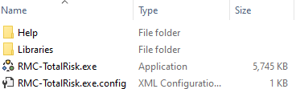
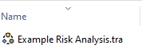

# Installing RMC-TotalRisk {#installation}

RMC-TotalRisk version 1.0 is available as a portable package (.zip). Installing a portable package does not require administrative rights. Simply extract all contents of the portable package to the desired computer location. Figure \@ref(fig:figure-1) shows an example of the package contents after extraction. Double-click the executable **RMC-TotalRisk.exe** to get started. For easy access to the program, create a desktop shortcut and pin the program to the Windows task bar. 

```{r figure-1, echo=FALSE, fig.cap="RMC-TotalRisk executable file in the RMC-TotalRisk portable .zip directory.", fig.align="center"}

```

## Setting the File Association in Windows

RMC-TotalRisk files have a “.tra” file extension. To have Windows automatically open .tra files with RMC-TotalRisk, right-click a .tra project file. Select **Open with…** from the resulting menu (Figure \@ref(fig:figure-2)). 

```{r figure-2, echo=FALSE, fig.cap="Right-click to select how to open a file in Windows.", fig.align="center"}
knitr::include_graphics("images/figure2.png")
```

From the menu that appears when you select **Open with…**, click **Try an app on this PC** for an expanded list of already installed applications. If RMC-TotalRisk is not an option, scroll to the bottom and select **Look for another app on this PC**. This opens a Windows Explorer dialog. Navigate to and select the executable **RMC-TotalRisk.exe**, then click **Open**. 

When you’ve found RMC-TotalRisk and selected it, check the box labeled **Always use this app to open [.tra] files** before you click the **OK** button. Now .tra files appear in Windows Explorer with the RMC TotalRisk icon (Figure \@ref(fig:figure-3)). You can now double-click a project file to automatically open it with RMC-TotalRisk.

```{r figure-3, echo=FALSE, fig.cap="RMC-TotalRisk project with file association in Windows.", fig.align="center"}

```

## System Requirements

The RMC-TotalRisk program and all dependent libraries were developed using the .NET Framework 4.8.1. As such, the program is currently only available for the Microsoft Windows operating system. The recommended system configuration for RMC-TotalRisk includes:

-	64-bit Windows Operating System (Windows 10 or newer).

-	512 MB of RAM at a minimum.

-	2 GB of free disk space at a minimum.

-	Quad-Core CPU with 2.7 GHz (or faster) clock speed.

-	1280 x 1024 screen resolution or higher (and at least a 17" monitor).

## Terms and Conditions for Use

The United States Government, U.S. Army Corps of Engineers, Risk Management Center (“RMC”) grants to the user the rights to install RMC-TotalRisk “the Software” (either from a copy obtained from RMC, a distributor or another user or by downloading it from a network) and to use, copy and/or distribute copies of the Software to other users, subject to the following Terms and Conditions of Use:

All copies of the Software received or reproduced by or for user pursuant to the authority of this Terms and Conditions of Use will be and remain the property of RMC. User may reproduce and distribute the Software provided that the recipient agrees to the Terms and Conditions for Use noted herein.

RMC is solely responsible for the content of the Software. The Software may not be modified, abridged, decompiled, disassembled, unobfuscated or reverse engineered. The user is solely responsible for the content, interactions, and effects of any and all amendments, if present, whether they be extension modules, language resource bundles, scripts or any other amendment.

The name “RMC-TotalRisk” must not be used to endorse or promote products derived from the Software. Products derived from the Software may not be called “RMC-TotalRisk” nor may any part of the “RMC TotalRisk” name appear within the name of derived products. No part of this Terms and Conditions for Use may be modified, deleted or obliterated from the Software. No part of the Software may be exported or re-exported in contravention of U.S. export laws or regulations.

### Waiver of Warranty

THE UNITED STATES GOVERNMENT AND ITS AGENCIES, OFFICIALS, REPRESENTATIVES, AND EMPLOYEES, INCLUDING ITS CONTRACTORS AND SUPPLIERS PROVIDE RMC TOTALRISK “AS IS,” WITHOUT ANY WARRANTY OR CONDITION, EXPRESS, IMPLIED OR STATUTORY, AND SPECIFICALLY DISCLAIM ANY IMPLIED WARRANTIES OF TITLE, MERCHANTABILITY, FITNESS FOR A PARTICULAR PURPOSE AND NON-INFRINGEMENT. Depending on state law, the foregoing disclaimer may not apply to you, and you may also have other legal rights that vary from state to state.

### Limitation of Liability

IN NO EVENT SHALL THE UNITED STATES GOVERNMENT AND ITS AGENCIES, OFFICIALS, REPRESENTATIVES, AND EMPLOYEES, INCLUDING ITS CONTRACTORS AND SUPPLIERS, BE LIABLE FOR LOST PROFITS OR ANY SPECIAL, INCIDENTAL OR CONSEQUENTIAL DAMAGES ARISING OUT OF OR IN CONNECTION WITH USE OF RMC-TOTALRISK REGARDLESS OF CAUSE, INCLUDING NEGLIGENCE.

THE UNITED STATES GOVERNMENT’S LIABILITY, AND THE LIABILITY OF ITS AGENCIES, OFFICIALS, REPRESENTATIVES, AND EMPLOYEES, INCLUDING ITS CONTRACTORS AND SUPPLIERS, TO YOU OR ANY THIRD PARTIES IN ANY CIRCUMSTANCE IS LIMITED TO THE REPLACEMENT OF CERTIFIED COPIES OF RMC-TOTALRISK WITH IDENTIFIED ERRORS CORRECTED. Depending on state law, the above limitation or exclusion may not apply to you.

### Indemnity

As a voluntary user of RMC-TotalRisk you agree to indemnify and hold the United States Government, and its agencies, officials, representatives, and employees, including its contractors and suppliers, harmless from any claim or demand, including reasonable attorneys' fees, made by any third party due to or arising out of your use of RMC-TotalRisk or breach of this Agreement or your violation of any law or the rights of a third party.

### Assent

By using this program you voluntarily accept these terms and conditions. If you do not agree to these terms and conditions, uninstall the program and return any program materials to RMC (If you downloaded the program and do not have disk media, please delete all copies, and cease using the program).

