# Graphical User Interface {#gui}

RMC-TotalRisk is a menu-driven software package that performs risk analyses. The software features a fully integrated modeling platform, including a modern graphical user interface, data entry capabilities, multi-failure risk analysis, and report-quality charts.

The graphical user interface consists of a menu bar, tool bar, and four window panes (Figure \@ref(fig:figure-4)): the Project Explorer, Tabbed Documents, Properties, and the Message window. You may move, dock, hide, or close the panes as desired.

```{r figure-4, echo=FALSE, fig.cap="RMC-TotalRisk graphical user interface.", fig.alt="The full graphical user interface of RMC-TotalRisk, including the project explorer (left), tabbed documents (center), properties (right), and message window (bottom).", fig.align="center"}
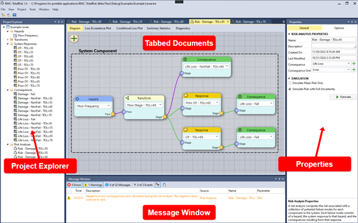
```

## Menu Bar {#gui-menu-bar}

The menu bar at the top of the window (Figure \@ref(fig:figure-5)) contains important commands for working with RMC TotalRisk. The following subsections provide detail on each command.

```{r figure-5, echo=FALSE, fig.cap="RMC-TotalRisk menu bar.", fig.alt="The menu bar with important commands horizontally displayed as File, View, Project, Tools, Window, and Help.", fig.align="center"}
 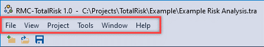
```

### File {#gui-menu-bar-file}

The File menu (Figure \@ref(fig:figure-6)) provides essential file management functionality. From this menu, you create a new project, open an existing project, save or save as, open recent projects, or exit the application. 

```{r figure-6, echo=FALSE, fig.cap="File menu.", fig.alt="The file menu drop-down with new, open, save, save as, and recent project options.", fig.align="center"}
 knitr::include_graphics("images/figure6.png")
```

The first time you use RMC-TotalRisk, the recent projects list will be empty. If your recent projects exceed the number that the list shows at one time (the default is 10), a menu item labeled **More Files…** is available. That option opens a Recent Files dialog showing all available recent project files (Figure \@ref(fig:figure-7)). From here, you may open any recently used project file or clear the recent project file list. 

```{r figure-7, echo=FALSE, fig.cap="Recent file dialog.", fig.alt="The recent file dialog lists all recent files vertically in a scrollable list.", fig.align="center"}
 knitr::include_graphics("images/figure7.png")
```

### View {#gui-menu-bar-view}

You may move, dock, hide, or close the Project Explorer, the Properties window, and Message window as desired. The View menu (Figure \@ref(fig:figure-8)) allows you to unhide or open these windows. In addition, you can restore the default layout of the panes. 

```{r figure-8, echo=FALSE, fig.cap="View menu.", fig.alt="The view menu drop-down with options to view the project explorer, message window, properties window, all windows, and restore default layout.", fig.align="center"}
 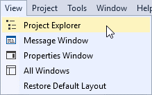
```

### Project {#gui-menu-bar-project}

The Project menu (Figure \@ref(fig:figure-9)) contains commands related to the project you are working in. From this menu, you can create a new hazard, transform, system response, or consequence function. You can also add a new risk analysis. In addition, you can edit the project properties through the Properties window.

```{r figure-9, echo=FALSE, fig.cap="Project menu.", fig.alt="The project menu drop-down with options to create input functions, create a risk analysis, and edit the project properties.", fig.align="center"}
 knitr::include_graphics("images/figure9.png")
```

### Tools {#gui-menu-bar-tools}

The Tools menu (Figure \@ref(fig:figure-10)) provides tools for managing your project and personalizing your workspace.

```{r figure-10, echo=FALSE, fig.cap="Tools menu.", fig.alt="The tools menu drop-down with showing several options to manage your project, including creating a batch run and setting the software options.", fig.align="center"}
 knitr::include_graphics("images/figure10.png")
```

-	**Compact & Optimize Project File** compacts and optimizes the project database and removes unnecessary tables. This tool can significantly reduce the size of your file without losing any project data.

-	**Zip Project File** zips your project file and prompts you to save the .zip to a location on your computer. The zip file is smaller and easier to share with others.

-	**Restore From Backup** restores the project from the backup file (***.tra.bak). Note: RMC-TotalRisk creates a backup file every 30 minutes by default. You can change the backup frequency in the Options dialog, File Management tab.

-	**Equivalent Annual Consequences** (Figure \@ref(fig:figure-11)) calculates equivalent annual consequences (EqAC) between two risk analyses. EqAC is required in USACE cost evaluation procedures [@cite-TechRef]. The EqAC is automatically calculated when you define the analysis period (in years) and a discount rate (as a percentage), then select current and future risk analyses and the year those results represent. Use the table tools to add and remove EqAC calculations. You can also manually enter base and future plan results by clicking in the dropdowns and typing the value.

```{r figure-11, echo=FALSE, fig.cap="Equaivalent Annual Consequences tool.", fig.alt="The equivalent annual consequences tool dialog showing a comparison of four design plans with a 50-year lifecycle. ", fig.align="center"}
 knitr::include_graphics("images/figure11.png")
```

-	**Batch Run** (Figure \@ref(fig:figure-12)) simulates multiple risk analyses as a batch process. Batch processing is very useful when inputs have been changed that are common across multiple risk analyses.

```{r figure-12, echo=FALSE, fig.cap="Batch Run Risk Analyses tool.", fig.alt="The batch run dialog lists all the risk analyses vertically in a scrollable list. Multiple analyses can be selected and run.", fig.align="center"}
 knitr::include_graphics("images/figure12.png")
```

-	**Options** lets you customize the application, file management, Message window, and default settings. See section \@ref(options) for more details.

### Window {#gui-menu-bar-window}

The Window menu allows you to close or activate document windows. The active window has a check mark next to it, as shown in Figure \@ref(fig:figure-13). 

```{r figure-13, echo=FALSE, fig.cap="Window menu.", fig.alt="The window menu drop-down with options to close all documents and options to manage all open windows.", fig.align="center"}
 knitr::include_graphics("images/figure13.png")
```

You can see all open windows by clicking **Windows…**, which opens a Windows dialog (Figure \@ref(fig:figure-14)). From here, you can activate or save specific document windows. In addition, you can select and close multiple windows at once. 

```{r figure-14, echo=FALSE, fig.cap="Windows dialog.", fig.alt="The windows dialog lists all open windows vertically in a scrollable list.", fig.align="center"}
 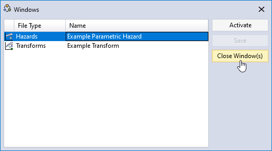
```

### Help {#gui-menu-bar-help}

From the Help menu, you can access this User's Guide (Figure \@ref(fig:figure-15)), view the Terms and Conditions for Use, or view the About RMC-TotalRisk splash screen (Figure \@ref(fig:figure-16)). 

```{r figure-15, echo=FALSE, fig.cap="Help menu.", fig.alt="The help menu drop-down with options to open the user guide, terms and conditions for use, and the about splash screen.", fig.align="center"}
 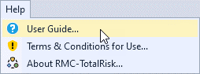
```

```{r figure-16, echo=FALSE, fig.cap="About RMC-TotalRisk splash screen.", fig.alt="The about splash screen showing the software icon, version number, and contact information.", fig.align="center"}
 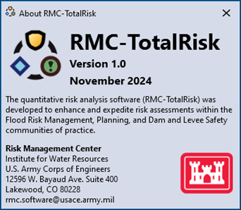
```

## Tool Bar {#gui-tool-bar}

The Tool Bar is on the main window, below the Menu Bar, with buttons for frequently used options under the File menu: New Project, Open Project, and Save Project (Figure \@ref(fig:figure-17)).

```{r figure-17, echo=FALSE, fig.cap="RMC-TotalRisk tool bar.", fig.alt="The tool bar with new, open, and save project commands displayed horizontally below the menu bar.", fig.align="center"}
 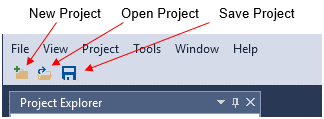
```

## Window Layout {#gui-window-layout}

In RMC-TotalRisk, you can customize the position, size, and behavior of windows to create layouts that work best for you. When you customize the layout, RMC-TotalRisk remembers the configuration. For example, if you change the docking location of the Project Explorer and then close RMC-TotalRisk, the next time that you open the software, the Project Explorer is docked in that same location. 

### Types of Windows

RMC-TotalRisk has four basic window types: the Project Explorer, Tabbed Documents, Properties, and the Message Window (Figure \@ref(fig:figure-4)). These windows provide editing and reviewing space for the various project components, including hazard, response, and consequence functions. For tool windows, resize and drag them by their title bars. For document windows, drag them by their tabs. 

On the title bars in the Project Explorer, Properties window, and Message Window, a dropdown offers other options (Figure \@ref(fig:figure-18)). 

```{r figure-18, echo=FALSE, fig.cap="Tools window options.", fig.alt="The tool window title bar drop-down showing options to float or hide the window.", fig.align="center"}
 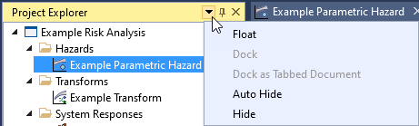
```

On the Tabbed Documents pane, you can right-click on document tabs to set other options on the window. These options include docking, floating, and hiding windows (Figure \@ref(fig:figure-19)). 

```{r figure-19, echo=FALSE, fig.cap="Document window options.", fig.alt="The document window drop-down showing several options to close, float, and create new horizontal or vertical tab groups.", fig.align="center"}
 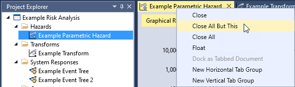
```

### Tab Groups

When you are working with two or more open documents in RMC-TotalRisk, you can group tabbed documents to enhance your ability to manage a limited workspace. Organize multiple document and tool windows into either vertical or horizontal tab groups or move documents from one group to another by dragging and dropping them; even float and move windows and tab groups to different monitors. When you need to view or edit two documents at once, you can split windows by creating two horizontal tab groups, as shown in Figure \@ref(fig:figure-20).

```{r figure-20, echo=FALSE, fig.cap="Split document windows.", fig.alt="The tabbed document windows are split horizontally displaying separate inputs on the left and the right of the screen.", fig.align="center"}
 knitr::include_graphics("images/figure20.png")
```

### Move and Dock Windows

You can dock a document window in the Tabbed Documents area or float it as a separate window independent of the main window. You can arrange windows in the following ways:

-	Dock tool windows to the edge of the main window frame. 

-	Float tool and document windows over or outside the main window. 

-	Hide tool windows along the edge of the main window. 

-	Display windows on different monitors.

-	Reset window placement to the default layout by choosing **View > Reset Default Layout**. 

Arrange windows by dragging or right-clicking the title bar or tab of the window being arranged. When you click and drag the title bar of a tool window or the tab of a document window, a cross-shaped window placement guide appears. During the drag operation, when the cursor is over one of the arrows in the guide, a shaded area appears that shows you where the window docks if you release the mouse button. Figure \@ref(fig:figure-21) and Figure \@ref(fig:figure-22) show examples of the window placement guide.

```{r figure-21, echo=FALSE, fig.cap="Moving and docking document windows.", fig.alt="The tabbed document is being moved and relocated using the placement guide.", fig.align="center"}
 knitr::include_graphics("images/figure21.png")
```

Figure 22 shows the Properties window being docked below the Project Explorer. The new location is demarcated by the light blue shared area.

```{r figure-22, echo=FALSE, fig.cap="Example of docking the Properties window below the Project Explorer.", fig.alt="The document is being docked into a new location using the placement guide.", fig.align="center"}
 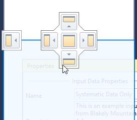
```

### Close and Auto-Hide Tool Windows

You can close a tool window by clicking on the X in the upper right of the title bar. To reopen the tool window, navigate to the View menu and select the desired tool window to show. Tool windows have an auto-hide feature, which causes a window to slide out of the way when you use a different window. When a window is auto-hidden, the window name appears on the tab at the edge of the main window, as shown in Figure \@ref(fig:figure-23). To show the window again, move your mouse cursor over the tab and the window slides back into view. 

```{r figure-23, echo=FALSE, fig.cap="Auto-Hide tool window.", fig.alt="Clicking the auto hide pin moves the tool window and hides it on the right side of the screen.", fig.align="center"}
 knitr::include_graphics("images/figure23.png")
```

## Project Explorer

The Project Explorer* which is typically on the left-hand side of the main window, shows a graphical representation of the hierarchy of elements within your project (Figure \@ref(fig:figure-24)). After you create a new project, you can use the Project Explorer to view, navigate, and manage the project elements. 

```{r figure-24, echo=FALSE, fig.cap="Project Explorer.", fig.alt="The project explorer located on the left of the screen showing folders for the project elements, such as hazards, transforms, system responses, consequences, and risk analyses.", fig.align="center"}
 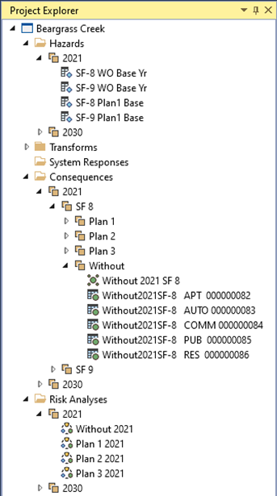
```

Project elements are organized under folder headers: Hazards, Transforms, System Responses, Consequences, and Risk Analyses. 

Many menu commands are available by right-clicking on various items in the Project Explorer. You can create new elements, create groups, or sort the items in each folder by right-clicking the folder icon or name (Figure \@ref(fig:figure-25)).

```{r figure-25, echo=FALSE, fig.cap="Example of a menu available by right-clicking on a Project Explorer folder header.", fig.alt="The hazards folder is right-clicked to display the context menu with several options such as creating a new folder group.", fig.align="center"}
 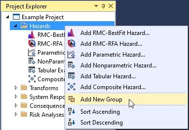
```

When right-clicking an individual project element, the following commands are available: Edit, Copy, Rename, Delete, Move Up, and Move Down (Figure \@ref(fig:figure-26), left side). When multiple project elements are selected, three right-click menu commands are available: Group, Edit, and Delete (Figure \@ref(fig:figure-26), right side). Double-clicking a project element opens it for editing. 

```{r figure-26, echo=FALSE, fig.cap="Examples of menu options available by right-clicking on project elements: for a single selection (left) or multiple selections (right).", fig.alt="Different context menu options are available when clicking on single selections or multiple selections.", fig.align="center"}
 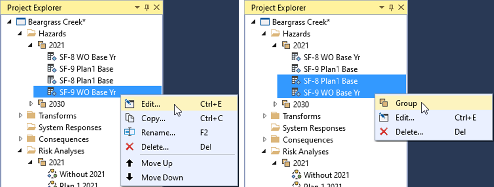
```

You can move individual project elements by left-clicking, holding, and dragging the element. A horizontal line indicates where the element will move to (Figure \@ref(fig:figure-27)). You can also drag and drop input data from one RMC-TotalRisk project to another.

```{r figure-27, echo=FALSE, fig.cap="Project Explorer element drag and drop.", fig.alt="The tabular hazard is being dragged upward and dropped at a higher location aided by a horizontal line.", fig.align="center"}
 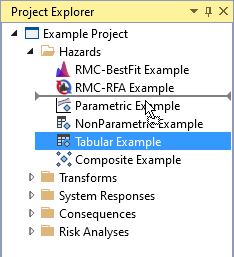
```

Grouping provides a way to manage the Project Explorer by consolidating project elements into subgroups. When right-clicking a group element, all commands from the root folder are available, as well as Ungroup and Rename (Figure \@ref(fig:figure-28)).

```{r figure-28, echo=FALSE, fig.cap="Project Explorer group elements.", fig.alt="Right-clicking a group header provides several options, such as ungrouping all the elements.", fig.align="center"}
 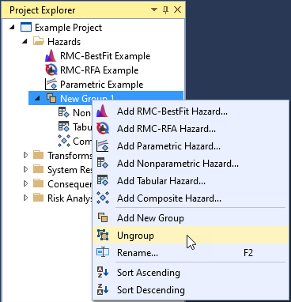
```

## Tabbed Documents

In RMC-TotalRisk, document windows contain the project element data, such as input tabular data, event trees, and risk analyses. Opening a project element for editing automatically opens the Tabbed Document pane, which is typically in the center of the main window (see Figure \@ref(fig:figure-29)). You can reorder the tabbed documents or drag or float them outside of the main window. When you click on, or activate, a document window, the Properties window shows the associated project element properties. 

```{r figure-29, echo=FALSE, fig.cap="Tabbed Document pane.", fig.alt="The tabbed documents have tabbed headers horizontally located at the top of the document pane.", fig.align="center"}
 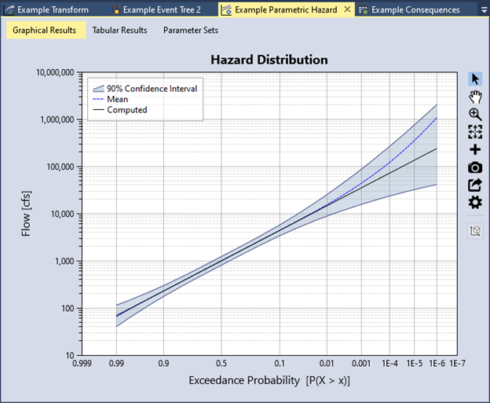
```

## Properties Window

The Properties window, typically on the right-hand side of the main window, displays the properties for the project and selected project elements. To access the element properties, open the element for edit. Some properties are common to all project elements, such as name and description, while others are unique to the specific elements. Properties are organized into groups for easier navigation. When you click on a property, the property description displays at the bottom of the Properties window, as shown in Figure \@ref(fig:figure-30). All analyses run from the Properties window. 

```{r figure-30, echo=FALSE, fig.cap="Properties window.", fig.alt="The properties window contains all the key properties and inputs for the project elements.", fig.align="center"}
 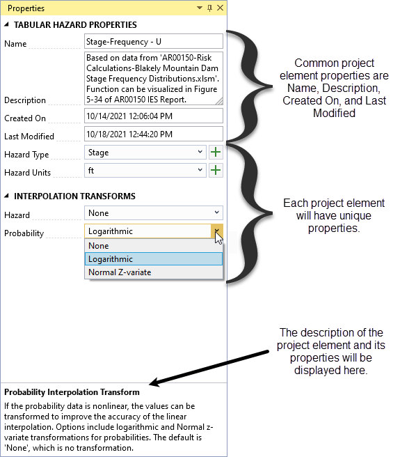
```

## Message Window

The Message window (Figure \@ref(fig:figure-31)) shows you errors, warnings, messages, and event logs regarding the current state of your project. If your project file has any errors, they are listed here. The Message window lets you perform the following tasks:

-	Display the errors, warnings, messages, and events produced while you work in RMC-TotalRisk. 

-	Double-click any error message entry to open the project element where the problem occurs. 

-	Filter the types of entries that the Message window displays by clicking on the tabs. The default is to only display errors and warnings.

-	Export all entries to a text file. 

Once you resolve an error, warning, or message, the entry disappears from the Message window. You may customize the font color of the various message types by navigating to **Tools > Options**. See section \@ref(options) for more details.

```{r figure-31, echo=FALSE, fig.cap="Message window.", fig.alt="The message window showing one error message in red and one warning message in orange.", fig.align="center"}
 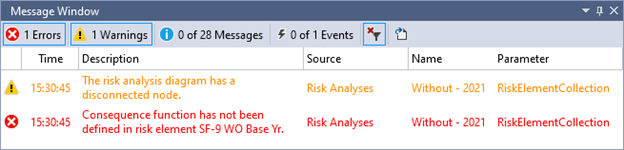
```

## Personalize RMC-TotalRisk {#options}

You can personalize RMC-TotalRisk in various ways to enhance the user experience by navigating to **Tools > Options**. The Options dialog allows you to customize the application, file management, Message Window, and default settings. 

### Application Options

You can set the application color theme to the Light or Blue theme, as shown in Figure \@ref(fig:figure-32) and Figure \@ref(fig:figure-33). The default is the Light theme. If you select **Save the window docking layout on close**, RMC-TotalRisk remembers it when you reopen the application. You can also set the number of window items in the Window menu and the number of recent project items in the Recent Project list under the File menu. 

```{r figure-32, echo=FALSE, fig.cap="Options dialog with light color theme.", fig.alt="Application options with the light color theme selected. Other options are shown for managing the docking layout and recent file list.", fig.align="center"}
 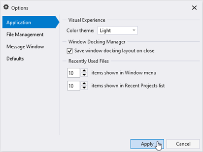
```

```{r figure-33, echo=FALSE, fig.cap="Options dialog with blue color theme.", fig.alt="Application options with the blue color theme selected. Other options are shown for managing the docking layout and recent file list.", fig.align="center"}
 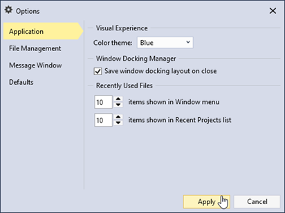
```

### File Management Options

RMC-TotalRisk project files are saved as SQLite databases. [SQLite](https://www.sqlite.org/) is a self-contained, high-reliability, SQL database engine, which is also one of the most used database engines in the world. Database files can grow quickly as you use them, sometimes hindering performance. They can also occasionally become corrupt or damaged. Under Tools, select **Compact & Optimize Project File** to prevent or fix these problems. You can also set RMC-TotalRisk to **Compact & optimize project file on close** by checking the checkbox. 

You can set the time interval in which a project backup file is created (Figure \@ref(fig:figure-34)). A file with the extension .bak is automatically created when a project is opened. If the project closes successfully, then the .bak file is deleted. On occasion, if the database file is damaged or corrupted, or the system closes unexpectedly causing you to lose important data, you might need to restore the project from a backup file by selecting **Tools > Restore from Backup** (Figure \@ref(fig:figure-35)).

```{r figure-34, echo=FALSE, fig.cap="File management options.", fig.alt="The file management options to manage file size and create and recover backup files.", fig.align="center"}
 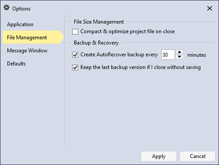
```

```{r figure-35, echo=FALSE, fig.cap="Restore from backup.", fig.alt="The tool menu drop-down with the restore from backup option selected.", fig.align="center"}
 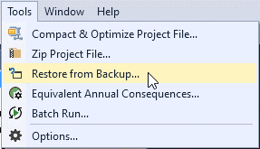
```

### Message Window Options

You can adjust the auditory and visual settings for the Message window. You can turn message beeps on or off and select the font color for the different message types, as shown in Figure \@ref(fig:figure-36).

```{r figure-36, echo=FALSE, fig.cap="Message window options.", fig.alt="The message window options to set the sound effects and colors of the message types.", fig.align="center"}
 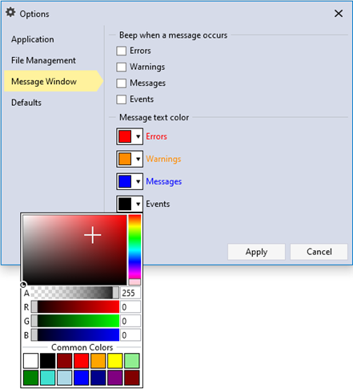
```

### Default Options

You can set the default project location directory and the default number of decimal digits for the project inputs and outputs (Figure \@ref(fig:figure-37)). In addition, you can set the default hazard type and units for each input function category. For example, by default, when you create a new hazard function, the hazard type and unit are automatically set to Stage and ft, respectively. 

If the desired hazard type or unit is missing, click the “plus” button to add a new option. If you want to delete an option, click the **X** that appears by that option inside the dropdown.

```{r figure-37, echo=FALSE, fig.cap="Default options.", fig.alt="The default options to set the decimal digits and hazard type and units of project input functions.", fig.align="center"}
 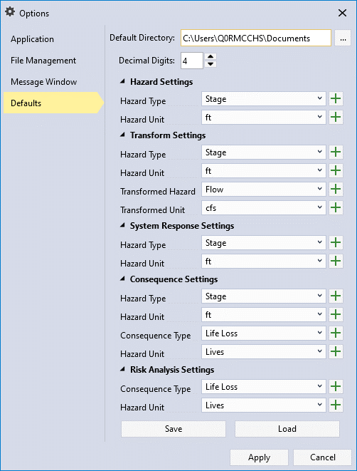
```

## Plot Features

RMC-TotalRisk’s plot features help you examine and customize the plots. Each plot has a toolbar to the right that lets you to interact with the plot in various ways (Figure \@ref(fig:figure-38)).

```{r figure-38, echo=FALSE, fig.cap="RMC-TotalRisk plot feature icons.", fig.alt="", fig.align="center"}
 knitr::include_graphics("images/figure38.png")
```

-  **Track Data** by clicking on any plotted point or line in the graph. A tooltip then displays the plot series name along with the X and Y data points (Figure \@ref(fig:figure-39)).

```{r figure-39, echo=FALSE, fig.cap="Using Track Data on a plot.", fig.alt="", fig.align="center"}
 knitr::include_graphics("images/figure39.png")
```

-  **Pan** the plot area by clicking, holding, and dragging the graph with your mouse. You can pan in any direction: up, down, or side to side. Alternatively, use the middle mouse button to pan by clicking, holding, and dragging.

-  **Zoom In** by clicking, holding, and dragging with your mouse to highlight the area of interest with the magnifying glass cursor (Figure \@ref(fig:figure-40)) You can also zoom in on a single axis by clicking, holding, and dragging along that axis. Alternatively, use the mouse wheel to zoom in or out.

```{r figure-40, echo=FALSE, fig.cap="Zooming in on a plot.", fig.alt="", fig.align="center"}
 knitr::include_graphics("images/figure40.png")
```

-  **Zoom Out** to return to the full plot extents. You can also press the Escape key to zoom out.

-  **Add Annotations** to the plot to provide additional information not included in a plot series. You can choose from the following annotation types: arrow, text, vertical line, horizontal line, rectangle, ellipse, point, polygon, and polyline (Figure \@ref(fig:figure-41)). Note: Legends cannot be annotated, and you cannot use annotations with the tracker.

```{r figure-41, echo=FALSE, fig.cap="Available plot annotations.", fig.alt="", fig.align="center"}
 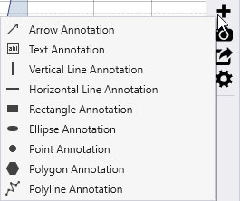
```

- Move annotations by clicking and dragging them to a new position. Figure \@ref(fig:figure-42) shows an example of an arrow and horizontal line annotation. You can edit the default annotation text by right-clicking on the annotation or through the plot properties window. 

```{r figure-42, echo=FALSE, fig.cap="Example of plot annotations.", fig.alt="A stage-frequency curve with a horizontal line annotation for the spillway elevation and an arrow annotation showing the flood of record.", fig.align="center"}
 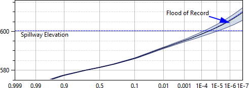
```

-  **Save** plot images as PNG, PDF, or SVG files. Choose from common image sizes or define your own dimensions (Figure \@ref(fig:figure-43)).

```{r figure-43, echo=FALSE, fig.cap="Set the width and height of the plot image.", fig.alt="A dialog for saving the plot image with a specific width and height.", fig.align="center"}
 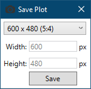
```

-  **Export** plot series data to a Comma Separate (.csv), Microsoft Excel® (.xlsx), or SQLite (.sqlite) file. Click the **Export Series Data** button to open a Save As dialog. Choose the file type, enter a name, and click **Save**. If you export to an existing Excel file, RMC-TotalRisk saves the plot series data as new tabs in that file.

-  **Edit Plot Properties** to customize the plot’s appearance (Figure \@ref(fig:figure-44)). In the Properties window, adjust general plot settings, legends, axes, series, and annotations. Use the dropdown in the upper-right corner to access other plot elements for editing. RMC-TotalRisk saves plot changes and applies them when you reopen the project. 

```{r figure-44, echo=FALSE, fig.cap="Plot properties.", fig.alt="The plot properties open to the right in the properties window. The user has full control over the appearance and format of the plot.", fig.align="center"}
 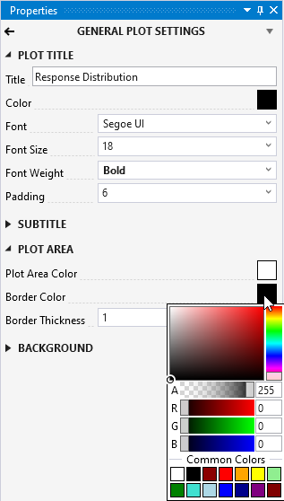
```

## Table Features

Tables in RMC-TotalRisk include versatile tools for adding and removing rows, exporting and copying data, and selecting rows. The following subsections describe these table features and tools in detail. 

### Add and Remove Row Tools

-  **Add Row**: Adds a row to the bottom of the table.

-  **Insert Row**: Inserts a row above the selected cell(s).

-  **Delete Row**: Deletes the row(s) containing the selected cell(s).

### Export and Copy Tools

-  **Select All Cells**: Selects all cells in the table.

-  **Copy Selected Cells**: Copies the currently selected cells to the clipboard for pasting into other applications (e.g., Microsoft Excel).

-  **Copy Selected Cells with Table Headers**: Copies the selected cells along with their headers for use in other applications.

-  **Paste from Clipboard into Table**: Pastes data from another table or application into the current table.

-  **Export Table**: Available for output tables only. Opens a Save As dialog to export the table in various formats, including Microsoft Excel (.xlsx). If you choose an existing Excel file, the table will be added as a new tab.

### Table Row Selection Tools

Row selection tools are exclusive to output tables. 

-  **Select Rows By Attribute**. Opens the Select By Attribute dialog box (Figure \@ref(fig:figure-45)), allowing you to perform queries, make selections, and locate features in the table.

```{r figure-45, echo=FALSE, fig.cap="Select By Attribute dialog.", fig.alt="The windows dialog showing a query that filters selected records where system attribute is greater than 0.001.", fig.align="center"}
 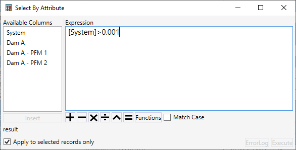
```

-  **Show All Rows**: Displays all rows in the table after an attribute-based selection. Selected rows are highlighted in blue.

- 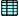 **Show Selected Rows Only**: Displays only the rows selected by the attribute-based query.

- 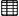 **Deselect All Rows**: Clears all row selections.

### Table Column Features

-	**Sort and Search**: Sort and search table columns. For numeric values in output tables, you can also generate summary statistics (Figure \@ref(fig:figure-46)). Sort by right-clicking on a column header and selecting the desired sort option or by double clicking on the column header to sort. Note: Double-clicking a column header that is already sorted sorts it in the opposite order. 

```{r figure-46, echo=FALSE, fig.cap="Table column header right-click options.", fig.alt="The table column header is right-clicked to display the context menu with several options such as sort, summary statistics and find.", fig.align="center"}
 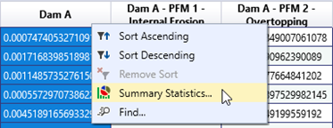
```

-	**Summary Statistics**: Use this tool to view detailed statistics for a column’s data. To calculate statistics for specific rows, check the **Selected Rows Only** box (e.g., rows where the System Response Probability (SRP) exceeds the 25th percentile) (Figure \@ref(fig:figure-47)).

```{r figure-47, echo=FALSE, fig.cap="Table column header right-click options.", fig.alt="A set of two windows. The top window displaying right-click context menu and the bottom window displaying summary statistics table on the left and a histogram plot on the right.", fig.align="center", out.width="85%"}
 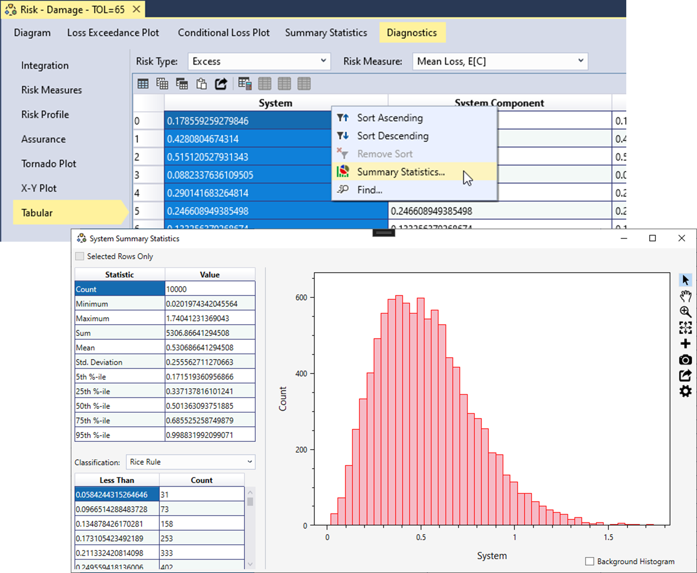
```
