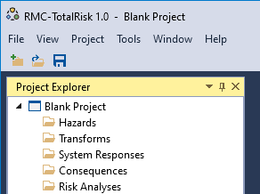
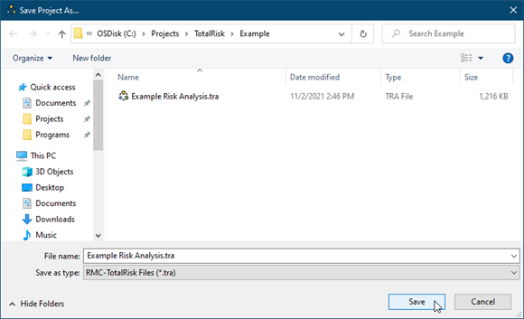
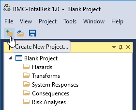
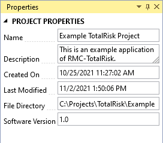

# Create a Project

When you open RMC-TotalRisk, it automatically creates a Blank Project file, as shown in Figure \@ref(fig:figure-48). The blank project is stored in your local temp directory. You may begin working with the blank project file immediately.

```{r figure-48, echo=FALSE, fig.cap="RMC-TotalRisk blank project.", fig.align="center"}

```

To save changes to the blank project, click the Save button on the tool bar or under the **File** menu. This opens the **Save Project As…** prompt (Figure \@ref(fig:figure-49)). Enter the desired file name and click the save button in the bottom right. Now you are ready to continue working with RMC-TotalRisk.

```{r figure-49, echo=FALSE, fig.cap="Save project as....", fig.align="center"}

```

You can also create a new project by clicking **New Project…** under the **File** menu (Figure \@ref(fig:figure-50)) or by clicking the **New Project** button on the tool bar (Figure \@ref(fig:figure-51)). The first time you use RMC TotalRisk, the recent projects list will be empty. 

```{r figure-50, echo=FALSE, fig.cap="Crete new project from the file menu.", fig.align="center"}
knitr::include_graphics("images/figure50.png")
```

```{r figure-51, echo=FALSE, fig.cap="Crete new project from the tool bar.", fig.align="center"}

```

The project properties are shown in the **Properties** window (Figure \@ref(fig:figure-52)), which is typically on the right hand side of the main window. You may edit the project name and description. 

```{r figure-52, echo=FALSE, fig.cap="Project properties.", fig.align="center"}

```
