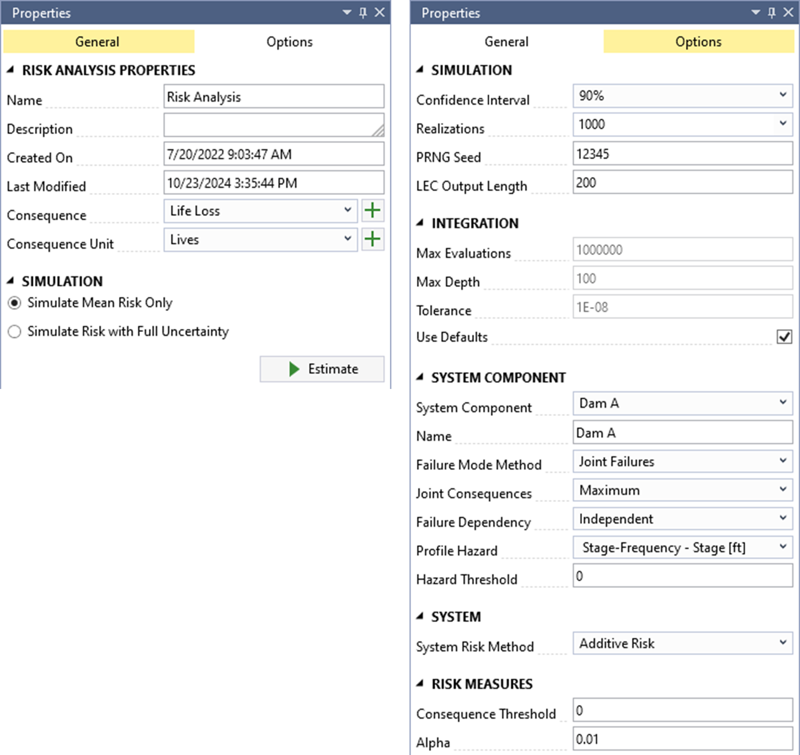
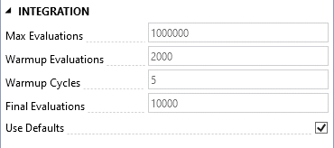
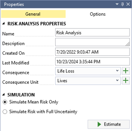

# Risk Analyses

In RMC-TotalRisk, you can conduct a risk analysis for a system with up to 20 system components. Each component requires three fundamental inputs: a hazard function, a system response function, and a consequence function. Transform functions are optional.

A risk analysis must include at least one system component. You can use multiple components to represent either different structures within the system or various hazard types affecting a single structure.

Each system component can include multiple system response functions, commonly referred to as failure modes. These failure modes may lead to different consequences. For example, in a dam scenario, a seepage failure mode might progress slowly, allowing downstream populations more time to evacuate. In contrast, a seismic failure mode could cause rapid failure, providing little evacuation time. At least one failure mode is necessary to calculate excess, failure, and total risks.

A system component can include only one non-failure mode. This mode does not require a response function but is essential for calculating excess, non-failure, background, and total risks. If no non-failure mode is provided, the system assumes the non-failure consequence is zero. 

To compute risk, a system component must include either a failure mode or a non-failure mode.

For more information on the quantitative risk analysis framework in RMC-TotalRisk, refer to the technical reference manual [@cite-TechRef].

## Create New Risk Analysis

To create a risk analysis, right-click on the **Risk Analyses** folder in the Project Explorer (Figure \@ref(fig:figure-123)) or navigate to **Project Menu > Risk Analyses** and select **Add Risk Analysis…**. Enter a name for the risk analysis and click **OK**.

```{r figure-123, echo=FALSE, fig.cap="Create a new risk analysis.", fig.align="center"}
knitr::include_graphics("images/figure123.png")
```

When you create a new risk analysis, it automatically opens in the Tabbed Documents area, and the Properties window displays the risk analysis properties (Figure \@ref(fig:figure-124)). In the Properties window, you can configure the name, description, consequence type, and consequence units. The consequence type and units are required, and all consequence functions in the analysis must match the selected consequence type.

You can access additional risk analysis options through the Options tab in the Properties window (Figure \@ref(fig:figure-124)). For most applications, the default risk analysis options provide reasonable results. The following sections explain the available risk analysis options in detail.
 
```{r figure-124, echo=FALSE, fig.cap="Risk analysis properties (general properties at left; risk analysis options at right).", fig.align="center", out.width="85%"}

```

## Simulation Options

The simulation options allow you to configure settings for the uncertainty analysis and the loss exceedance curve (LEC) results (Figure \@ref(fig:figure-125)). 

```{r figure-125, echo=FALSE, fig.cap="Risk analysis simulation options.", fig.align="center"}
knitr::include_graphics("images/figure125.png")
```

-	**Confidence Interval**: Specifies the width of the confidence interval (CI). For a 90% CI, the value of interest has a 90% probability of falling within the interval. CIs are computed only after simulating risk with full uncertainty. The default CI is 90%.

-	**Realizations**: Sets the number of Monte Carlo simulation realizations for simulating risk with full uncertainty. The default is 1,000 realizations, balancing reasonably accurate CIs with shorter runtimes. The maximum allowed number of realizations is 10,000 due to runtime and file size constraints. Running 10,000 realizations is recommended for the most accurate results, although minor sampling errors in mean risk results and percentiles may still occur with fewer realizations.

-	**PRNG Seed**: Defines the pseudo random number generator (PRNG) seed value for the Monte Carlo simulation. Using the same seed value ensures repeatable results, while changing the seed value alters the sequence of random numbers used in the simulation.

-	**LEC Output Length**: Specifies the number of points used to construct the LECs. An LEC displays risk results with consequences on the x-axis and exceedance probability on the y-axis. Using at least 200 points is recommended to enhance the accuracy of the curves.


## Integration Options

RMC-TotalRisk uses numerical integration to compute risk for each Monte Carlo realization.

When the risk analysis has a single system component, the **Adaptive Simpson’s Rule (ASR)** performs the numerical integration. Figure \@ref(fig:figure-126) shows the available options for the ASR method.

```{r figure-126, echo=FALSE, fig.cap="Risk analysis integration options when there is single system component.", fig.align="center"}
knitr::include_graphics("images/figure126.png")
```

- **Max Evaluations**: Specifies the maximum number of integrand evaluations allowed during numerical integration. The value must be between $10,000$ and $1,000,000$, with a default of $1,000,000$.

- **Max Depth**: Sets the maximum recursion depth for ASR integration. The default is $100$.

- **Tolerance**: Defines the desired tolerance for the ASR integration. This setting applies to the mean of the total system risk, with a default value of $10^{-8}$. 

When the risk analysis includes two or more system components and the **Joint System Risk Method** is selected, the adaptive importance sampling method **VEGAS** handles numerical integration. Figure \@ref(fig:figure-127) shows the available options for the VEGAS method.

```{r figure-127, echo=FALSE, fig.cap="Risk analysis integration options when there are multiple system components and the joint system risk method is selected.", fig.align="center"}

```

- **Max Evaluations**: Specifies the maximum number of integrand evaluations allowed during numerical integration. The value must be between $10,000$ and $1,000,000$, with a default of $1,000,000$.

- **Warmup Evaluations**: Determines the number of integrand evaluations per warmup cycle. The default is $1,000 \times D$, where $D$ is the number of integrand dimensions (i.e., system components). 

- **Warmup Cycles**: Sets the number of warmup cycles for the adaptive importance sampling method. The default is $5$. 

- **Final Evaluations**: Specifies the number of integrand evaluations performed after completing the warmup phase. The default is $10,000$. 

For more details on the numerical integration methods used by RMC-TotalRisk, refer to the technical reference manual [@cite-TechRef].

## System Component Options

Figure \@ref(fig:figure-128) shows the system component options.

```{r figure-128, echo=FALSE, fig.cap="Risk analysis system component options.", fig.align="center"}
knitr::include_graphics("images/figure128.png")
```

-	**System Component**: A system component consists of three key inputs: the hazard, the system response to that hazard, and the consequences given the response and hazard. By default, the system component is identified and labeled by the selected hazard function, which can only be used once per risk analysis. A single risk analysis is limited to 20 system components due to virtual memory and runtime constraints. Several options are available to customize how the risk analysis computes each system component.

-	**Name**: Users can edit the name of the selected system component. 

-	**Failure Mode Method**: This setting determines how the risk analysis accounts for multiple failure modes. Options include **joint**, **competing**, **common cause**, and **mutually exclusive** failures. Note: The **joint** and **competing** methods are computationally intensive and are limited to 20 failure modes. 

    -	**Joint** (default): Use this method when multiple failure modes can occur simultaneously during the same event. This method requires selecting a joint consequence rule. 

    -	**Competing**: Use this method when joint failures are not possible because the system component fails when the first of the competing failure modes reaches a failure state. The system response functions’ capacity automatically determines the failure mode order. Ensure that the system response functions increase monotonically.

    -	**Common Cause**: This method assumes a common cause initiates multiple failure modes, but joint failures are not possible. While included for backward compatibility with existing risk analysis software, use the competing method when feasible.

    -	**Mutually Exclusive**: Use this method when failure modes are disjoint (have no intersection) and cannot occur simultaneously. During the risk analysis, response probabilities exceeding 1 at a given hazard level are normalized.

-	**Joint Consequences**: This setting applies to the joint failure mode method and determines how joint failure consequences are treated. Options include **additive**, **average**, **maximum** (default), and **minimum**. 

    -	Use **additive** when failure modes affect different inundation areas, and the total consequences are best represented by adding consequences for each area. 

    -	Use **average** when inundation areas are partially overlapping.

    -	Use **maximum** when failure modes share the same inundation area to avoid overestimating consequences.

    -	Use **minimum** as a sensitivity or to establish a lower bound for risk. 

-	**Failure Dependency**: This option sets the statistical dependency between failure modes within the selected system component. It is unavailable for the mutually exclusive method. The dependency influences the joint probability of the response functions. The options include **independent** (default), **perfectly positive**, **perfectly negative**, or a user-defined **correlation matrix**. 

    -	The **Correlation Matrix** option becomes available when you select it as the dependency method. Clicking the button opens a table where you can enter correlation coefficients between failure modes. 
    

-	**Profile Hazard**: This option sets the hazard function used to construct risk profiles and estimate the probability of exceeding a hazard threshold. You can select the primary hazard function or any hazard-to-response transform functions. For levee accreditation analyses, use stage or water surface elevation as the profile hazard type.

-	**Hazard Threshold**: This setting defines the hazard level for calculating the probability of exceeding that threshold. The default hazard threshold is 0. For levee accreditation analyses, use the top of levee height or elevation as the hazard threshold. 

## System Options

The system options define how the system components interact in the risk calculations (Figure \@ref(fig:figure-129)). 

```{r figure-129, echo=FALSE, fig.cap="Risk analysis system options.", fig.align="center"}
knitr::include_graphics("images/figure129.png")
```

-	**System Risk Method**: This option determines how the analysis calculates system risk. The available methods are **additive** and **joint risk**: 

    -	**Additive Risk Method** (default): Assumes system components are independent, and their consequences can be summed. This method has shorter runtimes but does not generate system-level loss exceedance curves (LECs) and computes fewer system-wide risk measures.
    
    -	**Joint Risk Method**: Allows modeling dependencies between components and generates a complete set of system risk outputs, including system-level LECs and more comprehensive risk measures. However, this method typically has longer runtimes.
    
-	**Joint Consequences**: Defines how the risk analysis handles the consequences of joint events among system components. Options include **additive**, **average**, **maximum** (default), and **minimum**.

    -	Use **additive** when the system components have nonoverlapping inundation areas, where summing consequences is more appropriate. 

    -	Use **average** when inundation areas partially overlap, and averaging the consequences is appropriate.

    -	Use **maximum** when modeling various hazard types affecting a single structure to prevent overestimating the consequences.

    -	Use **minimum** as a sensitivity or to establish a lower bound for system risk. 

-	**Hazard Dependency**: Specifies the statistical dependency between system component hazards in the risk analysis. This option is only available for the joint risk method. The dependency influences the joint probability of the hazard functions. Options include **independent** (default), **perfectly positive**, **perfectly negative**, or a user-defined **correlation matrix**.

    -	The **Correlation Matrix** option becomes available when you select it as the dependency method. Clicking the button opens a table where you can enter correlation coefficients between system component hazard functions. 

## Risk Measure Options

RMC-TotalRisk offers additional risk measures that are valuable for the risk-based design of engineering structures. These measures are calculated for the entire system rather than individual components. Figure \@ref(fig:figure-130) displays the risk measure options.

```{r figure-130, echo=FALSE, fig.cap="Risk measure options.", fig.align="center"}
knitr::include_graphics("images/figure130.png")
```

-	**Consequence Threshold**: Specifies the consequence level for calculating the probability of exceeding that threshold. The default consequence threshold is $0$.

-	**Alpha** Sets the exceedance probability used to compute the Value-at-Risk (VaR) and Conditional Value-at-Risk (CVaR). The default exceedance probability is $10^{−2}$.

For more details about the additional risk measures in RMC-TotalRisk, refer to the technical reference [@cite-TechRef].

## Risk Diagram

RMC-TotalRisk defines a risk analysis through a diagram, as shown in Figure \@ref(fig:figure-131). The diagram provides an intuitive way to create and connect the various components of the modeled system. 

A risk analysis computes the risk associated with a collection of potential failure modes for each component in the system. A failure mode is composed of a hazard, the system response to the hazard, and the consequences given the response to the hazard. A non-failure mode is composed of a hazard and the non-failure consequences given the hazard.

Figure 131 shows a single system component for a dam safety risk analysis. A non-failure mode, shown at the top of the diagram with the purple line, connects the hazard function to the non-failure consequences, without any system response. Many dams often have consequences even if the structure does not fail. For example, during a major flood event, a dam could activate the emergency spillway, preventing the dam from reducing downstream flooding. The non-failure mode models the risk of non failure (USACE 2022). 

The two failure modes are:

1.	A spillway erosion failure mode, labelled PFM 1, shown in the center of the diagram, connects the hazard function at Dam A to the PFM 1 response function and consequence function.

2.	A concentrated leak erosion failure mode, labelled PFM 2, shown in the bottom of the diagram with the same respective connections. 

In the risk diagram, the input functions connect from left to right and link together based on each function’s hazard type (e.g., stage, flow) and units (e.g., ft, cfs). There cannot be any circular or redundant connections. As such, the risk diagram is a type of directed acyclic graph (DAG). 

The system components are identified and labeled by the selected hazard function. You can rename system components by right-clicking the name in the risk diagram or editing the name in the Properties window. The failure modes within a component are identified and labeled by the selected response functions. 

RMC-TotalRisk permits an unlimited number of failure modes per component, depending on the selected failure mode method. However, a single system is limited to 20 components due to virtual memory and computer runtime limitations. For example, you can assess the system risk of a watershed comprising up to 20 dams, each with multiple failure modes. 


### Creating a Diagram

First, get a feel for working with the diagram. Use your mouse to left-click and drag any open area in the diagram to pan the diagram surface. Zoom in and out on the diagram using the mouse wheel.

Inputs to the risk analysis are designated using nodes in the diagram. Select the desired input function for a node using the selection box. Left-click and drag on any node to move the node around the diagram. A blue circle at the bottom left of the node shows the required inputs for each node (Figure 132). An orange circle at the lower right of the node shows the node output.

You can add a node to the risk diagram in three ways, as shown in Figure 133: 

-	Place the mouse cursor over the large plus symbol in the upper left corner of the diagram to open a selection box, then left-click and drag to move the node to the desired location. 

-	Right-click on any empty space in the diagram to open a selection box to add a node at that location.

-	Left-click on a node output to open a selection box. This third option has the added benefit of automatically connecting the new node to the clicked node output.

To connect two nodes, left-click and hold on a node output and drag toward the node you’re connecting to. A line appears from the node output to the mouse cursor. Move the mouse cursor over the input of the desired node and release the mouse button to connect. See Figure 134.

To delete a node, either right-click on the node and select Delete or click the X that appears in the top right corner of the node when the cursor is over the node. To disconnect two nodes, left-click and hold the input to the connected node and move the cursor to either another node’s input or remove the connection by clicking in any open space of the diagram.

The diagram has four fundamental node types:

 	Hazard. A hazard function describes the exceedance probabilities of various hazard levels. Examples include annual maximum peak flow-frequency, peak reservoir pool stage frequency, and peak ground acceleration. The system component is identified and labeled by the selected hazard function. You can make multiple connections to a selected hazard function.
 	
 	Transform. A transform function transforms (or converts) the hazard levels from one type of function to another. The required input to this node is the hazard type being transformed. The node output is the hazard type that the function is transforming into. You can make multiple connections from a transform function, unless it is transforming a response function, and you can connect multiple transforms sequentially. For example, an unregulated flow-frequency may need to be transformed into a regulated flow and then transformed again from flow to stage to assess probability of failure on hydraulic structures downstream.
 	
 	Response. A system response function describes the conditional probability of failure for various hazard levels, such as WSEs. The failure modes within a system component are identified and labeled by the selected response function. A system component can have multiple failure modes, each with different consequences. The required input is the hazard type defined by the selected response function. The output type is the same as the input. The output can only have one connection.
 	
 	Consequence. A consequence function describes the consequences of failure or non-failure for various hazard levels, such as annual maximum peak WSEs. Note that each response node can have a different consequence node, and a consequence function connected to the hazard node without a response function is considered the non-failure component of the element. A consequence node has one required input, the hazard defined by the selected consequence function

The risk diagram provides the following visual feedback on input data validation:

 	No Input Selected. A node with no input selected is highlighted with a red outline.
 	
 	Incomplete Connection. A black connection indicates nothing is wrong with the connection, and the units match, but it lacks a completely connected failure or non-failure mode. The risk calculations will not include this connection.
 	
 	Invalid Connection. A red connection means the connection is not valid. Either the hazard units do not match or an input hasn’t been defined for one of the nodes. The risk analysis cannot be computed if a connection is invalid.
 	
 	Valid Non-Failure Mode Connection. A purple connection is for valid non-failure modes. It indicates that every connection in a system component is valid and the non-failure mode is complete. A system component with purple connections for the non-failure mode indicates that the risk calculations include the component.

Figure 135 shows the risk diagram for a levee risk analysis. The hazard function is a river peak flow frequency curve. Peak flow is transformed to a peak river stage using a flow-to-stage rating curve derived from a hydraulic routing model. PFMs include a prior-to-overtopping failure mode (Prior OT) from backward erosion piping and an overtopping (OT) failure mode. The two failure modes have green connectors. The non-failure mode is at the top with the purple connectors. Non-fail consequences connect directly to the hazard transform function with no response function in between. 

## Risk Simulation

Once you have created a risk analysis and configured the desired options, you can run a risk simulation. Choose between two simulation methods (Figure \@ref(fig:figure-riskprop)):

- **Simulate Mean Risk Only** (default): This method uses the mean result from each input function to compute risk.

- **Simulate Risk with Full Uncertainty**: This method employs Monte Carlo simulation to estimate risk using the full range of uncertainty from each input function

To calculate a risk estimate, click the **Estimate** button.

```{r figure-riskprop, echo=FALSE, fig.cap="Risk simulation options.", fig.align="center"}

```

Figure \@ref(fig:figure-risksim) illustrates the overall risk and Monte Carlo simulation framework used in RMC-TotalRisk. The **Mean Risk Only** method is computationally efficient and can be completed in a single loop, as shown on the left side of the figure. However, this method approximates risk and may not fully capture combinations of low-probability, high-consequence events. Consequently, it can underestimate variance and tail risk.

For scenarios involving significant uncertainty in extreme events, it is recommended to use the **Simulate Risk with Full Uncertainty** option for a more accurate assessment.

For a detailed explanation of the risk analysis framework, simulation options, algorithms, and underlying mathematics, refer to the technical reference manual [@cite-TechRef].

```{r figure-risksim, echo=FALSE, fig.cap="Flowchart of the TotalRisk simulation options: (a) Simulate mean risk only, and (b) Simulate risk with full uncertainty.", fig.align="center"}
knitr::include_graphics("images/risksimulation.png")
```
