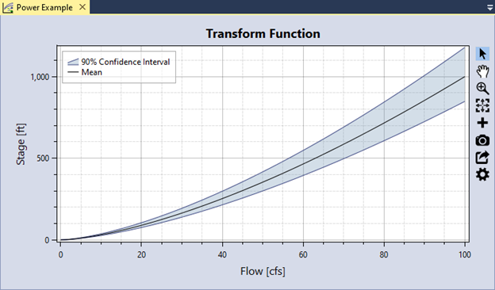
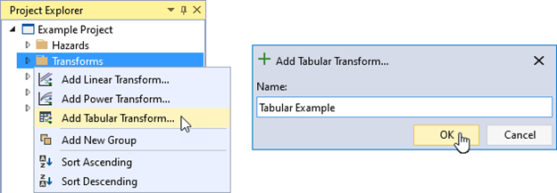
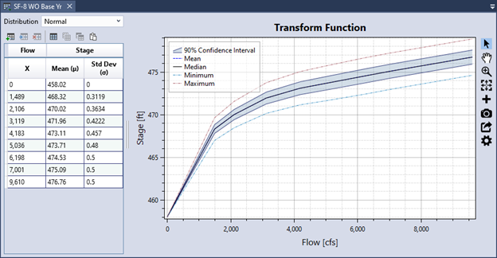

# Transform Functions

In RMC-TotalRisk, transform functions change one hazard type into another hazard type. For example, you can use a flow-stage rating curve derived from a hydraulic model to transform a peak flow-frequency function into a stage-frequency function. The following subsections describe each transform function option in detail.

## Linear Transform Function

This option applies a simple linear function to transform one type of hazard into another:

\begin{equation}
    Y = \alpha + \beta X + \varepsilon
    (\#eq:linear)
\end{equation}

where $\varepsilon \sim N(0, \sigma)$.

To create a linear transform function, right-click on the **Transforms** folder in the Project Explorer (Figure \@ref(fig:figure-74)) or from **Project Menu > Transforms** and select **Add Linear Transform...**. Enter a name for the linear transform function and click **OK**.

```{r figure-74, echo=FALSE, fig.cap="Create new linear transform function.", fig.align="center"}
knitr::include_graphics("images/figure74.png")
```

Creating a new linear transform function opens the Tabbed Documents area, and the Properties window displays the transform function properties (Figure \@ref(fig:figure-75)). In the Properties window, you can set the name, description, hazard type, hazard units, transformed hazard, transformed units, and linear transform parameters. Unchecking the **Uncertainty On** checkbox removes the standard error ($\sigma$) parameter, and only the slope ($\beta$) and intercept ($\alpha$) are required.

```{r figure-75, echo=FALSE, fig.cap="Linear transform function properties.", fig.align="center"}
knitr::include_graphics("images/figure75.png")
```

The Tabbed Document for a linear transform function includes a graphical representation of the function (Figure \@ref(fig:figure-76)).

```{r figure-76, echo=FALSE, fig.cap="Linear transform function graphical display.", fig.align="center"}
knitr::include_graphics("images/figure76.png")
```

## Power Transform Function

This option applies a power function to transform one type of hazard into another: 

\begin{equation}
    Y = \left[ \alpha (X - \xi)^\beta \right] \cdot \varepsilon
    (\#eq:power)
\end{equation}

where $\varepsilon \sim N(0, \sigma)$. Ensure the standard error ($\sigma$) is in log-space.

To create a power transform function, right-click on the **Transforms** folder in the Project Explorer (Figure \@ref(fig:figure-77)) or from **Project Menu > Transforms** and select **Add Power Transform…**. Next, give the power transform function a name and click **OK**. 

```{r figure-77, echo=FALSE, fig.cap="Create new power transform function.", fig.align="center"}
knitr::include_graphics("images/figure77.png")
```

Creating a new power transform function opens the Tabbed Documents area and displays the Properties window with the transform function properties (Figure \@ref(fig:figure-78)). In the Properties window, you can set the name, description, hazard type, hazard units, transformed hazard, transformed units, and power transform parameters. Unchecking the **Uncertainty On** checkbox removes the standard error ($\sigma$) parameter, and only the coefficient ($\alpha$), exponent ($\beta$), and location ($\xi$) are required.

```{r figure-78, echo=FALSE, fig.cap="Power transform function properties.", fig.align="center"}
knitr::include_graphics("images/figure78.png")
```

The Tabbed Document for a power transform function contains a graphical representation of the function (Figure \@ref(fig:figure-79)).

```{r figure-79, echo=FALSE, fig.cap="Power transform function graphical display.", fig.align="center"}

```

## Tabular Transform Function

This option allows you to easily define a hazard transform function using tabular data. A common use case involves copying and pasting a transform function (e.g., a flow-stage rating curve) from another application, such as Microsoft Excel or HEC-RAS. 

To create a tabular transform function, right-click on the **Transforms** folder in the Project Explorer (Figure \@ref(fig:figure-80)) or from **Project Menu > Transforms** and select **Add Tabular Transform…**. Next, give the tabular transform function a name and click **OK**.

```{r figure-80, echo=FALSE, fig.cap="Create new tabular transform function.", fig.align="center"}

```

Creating the new tabular transform function opens the Tabbed Documents area, and the Properties window displays the tabular function properties (Figure \@ref(fig:figure-81)). In the Properties window, you can specify the name, description, hazard type, hazard units, transformed hazard, transformed units, and hazard and transformed hazard interpolation methods. These interpolation transforms define how the data is interpolated when sampling values between the specified tabular ordinates. 

```{r figure-81, echo=FALSE, fig.cap="Tabular transform function properties.", fig.align="center"}
knitr::include_graphics("images/figure81.png")
```

The Tabbed Document for a tabular function includes a table for entering data and a graphical representation of that data (Figure \@ref(fig:figure-82)). You can define uncertainty for the transformed hazard at each tabular ordinate. To do this, select a distribution type and enter the corresponding parameters for each ordinate in the tabular data. 

```{r figure-82, echo=FALSE, fig.cap="Example tabular transform function transforming flow to stage.", fig.align="center"}

```

### Data Validation

The input data table has built-in validation. Tabular data must meet the following requirements:

- The hazard values must be in ascending order.

-	If uncertainty is defined, each uncertain ordinate must contain valid distribution parameters.

When you enter invalid data, the table cell turns red, and a tooltip explains the error, as shown in Figure \@ref(fig:figure-83). Additionally, an error message appears in the Message window, prompting you to resolve all errors in the data table. 

```{r figure-83, echo=FALSE, fig.cap="Tabular transform function data validation.", fig.align="center"}
knitr::include_graphics("images/figure83.png")
```

