# System Response Functions

System response functions specify how a system responds to a given hazard. In RMC-TotalRisk, a system response function defines the conditional probability of failure for various hazard levels, such as WSEs. 

In dam and levee safety risk analyses, analysts develop system response functions for multiple potential failure modes (PFMs). Common PFMs include seepage and piping, erosion and bank caving, and overtopping. Each PFM may result in different consequence outcomes, so analysts should keep PFMs distinct in a risk analysis.

RMC-TotalRisk allows users to define system response functions using an event tree, parametric function, tabular function, bivariate tabular function, or a composite of multiple functions. The following subsections describe each input option in detail.

## Event Tree Response Function

Event tree analyses (ETAs) represent the logic of how an initiating event, like a flood or earthquake, can lead to various types of damage and failure [@cite-BestPractices]. An event tree consists of a sequence of interconnected nodes and branches [@cite-HartfordBaecher]. Each node corresponds to an uncertain event (e.g., a crack forming in an embankment) or an uncertain state of nature (e.g., the existence of adversely oriented joint planes). Branches originating from a node represent the possible events or states of nature that could occur. Probabilities are assigned to each node to quantify the likelihood of each event or condition, conditional on the occurrence of all preceding events in the tree. For more details on event tree calculations in RMC-TotalRisk, refer to [@cite-TechRef]. 

To create an event tree response function, right-click on the **System Responses** folder in the Project Explorer (Figure \@ref(fig:figure-84)) or navigate to **Project Menu > System Responses** and select **Add Event Tree Response…**. A dialog will appear, prompting you to enter the dataset name and select an event tree template to import. This example uses the Basic template to demonstrate how to build an event tree from scratch, but you can also choose from a variety of default or user-defined templates.

```{r figure-84, echo=FALSE, fig.cap="Create new event tree response function.", fig.alt="The Add Event Tree Response option under the right-click menu of System Responses on the left, and the event tree response function dialog box on the right allowing the user to enter the name of the response function and select a template from a dropdown.", fig.align="center"}
knitr::include_graphics("images/figure84.png")
```

After creating the new event tree response function, the Tabbed Documents area automatically opens, and the Properties window displays the event tree properties (Figure \@ref(fig:figure-85)). In the Properties window, you can configure the name, description, hazard type, hazard units, hazard interpolation, probability interpolation, and selected event tree node properties. The interpolation transforms define how the data is interpolated when sampling values between hazard levels.

```{r figure-85, echo=FALSE, fig.cap="Event tree response function properties.", fig.alt="The properties window includes two tabs General and Options. The General tab displays the event tree properties, dropdown selections for hazard and probability interpolations and the selected branch properties.", fig.align="center"}
knitr::include_graphics("images/figure85.png")
```

### Terminology

This section defines RMC-TotalRisk’s event tree terminology [@cite-TechRef].

-	**Node**: Represents a branching point in the event tree, signifying a random event or state. Event trees include four types of nodes:

    - &nbsp;**Initiating Hazard Node**: Always the first node in the event tree. This node defines the hazard levels and links system response probabilities to the hazard function. Enter only hazard levels for this node, not hazard exceedance probabilities. To improve the accuracy of dam and levee risk assessments, define at least five hazard levels. Start with a hazard level with a near-zero probability of failure and progress to a level exceeding the crest height. Include intermediate levels with critical features or inflection points, such as the normal pool or the spillway invert for dams.
 	
    - &nbsp;**Chance Node**: Represents the probability of an event occurring at each hazard level defined in the initiating hazard node. You can define probabilities as a single value for all hazard levels (single value), as unique values for each hazard level (multi-value), or by referencing another source (see "reference node").
 	
    - &nbsp;**Reference Node**: Functions like a chance node but pulls probabilities from a previously defined response function or node in the event tree instead of defining them directly at the node.
    
    - &nbsp;**Remainder Node**: Represents the probability remaining after accounting for all other chance and reference node probabilities at the current branching point. For example, if an event has two potential outcomes, the remainder node accounts for the probability that neither outcome occurs. The software computes the remainder probability automatically; users cannot modify it.

-	**Branch**: The line connecting two nodes in the event tree. 

-	**End Node**: A node with no downstream branches, representing the final state in a sequence of events. This is also called a leaf node or terminal node.. 

-	**Pathway**: A unique sequence of events representing a potential failure progression. The probability of a pathway equals the joint probability of all nodes in the series from the initiating hazard node to the end node. This is also referred to as a path, sequence, connection, or root-to-node. 

-	**Upstream Nodes**: Nodes located to the left of a selected node in the tree. These nodes must occur before the selected node’s event. Upstream nodes are also called parent nodes, conditional events, or preceding nodes. 

-	**Downstream Nodes**: Nodes located to the right of a selected node in the tree. These nodes occur after the selected node’s event. Downstream nodes are also called child nodes, conditional events, proceeding nodes, or subsequent nodes.

-	**Node Probability**: Represents the probability of the selected node event occurring, conditioned on the occurrence of all upstream nodes.

-	**Event Likelihood**: Represents the probability of a node event occurring at a given hazard level. This is the joint probability of the selected node event and all its upstream nodes. 

### Navigating an Event Tree

You can move the event tree around the workspace by clicking and dragging the background canvas with any mouse button. Use the mouse wheel to zoom in and out. When you hover over a node or branch, it highlights. Left-click to select nodes or branches, and right-click to display context menu options.

When you hover over a node, a toolbar appears above it, as shown in Figure \@ref(fig:figure-86). You can also access these toolbar options by right-clicking on a node.

```{r figure-86, echo=FALSE, fig.cap="Event tree node toolbar icons.", fig.alt="Displays icons for deleting branches from the target node, copying branches, pasting branches, and adding a new branch to the node.", fig.align="center"}
knitr::include_graphics("images/figure86.png")
```

- &nbsp;**Delete Branches**: Click this icon to remove all child branches from the selected node.

- 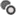&nbsp;**Copy Branches**: Click to copy the child branches into memory for pasting elsewhere.

- &nbsp;**Paste Branches**: Click to paste previously copied branches onto the current node.

- &nbsp;**Add New Branch**: Click to create a new branch from the selected node.

When you hover over a branch, a toolbar appears above its name, as shown in Figure \@ref(fig:figure-87). These options are also available by right-clicking on the branch. To rename a branch, double-click on it or use the branch properties.
 
```{r figure-87, echo=FALSE, fig.cap="Event tree branch toolbar icons.", fig.alt="Displays icons for deleting a branch, editing branch properties, and saving template.", fig.align="center"}
knitr::include_graphics("images/figure87.png")
```

- &nbsp;**Delete Branch**: Click to remove the selected branch and all its child branches from the event tree.

- &nbsp;**Branch Properties**: Click to edit branch properties such as name, description, and probabilities directly in the workspace.

- &nbsp;**Save Template**: Save the event tree as a template for future use. This option is only available on the initiating hazard branch.

### Customizing an Event Tree

The **Options** tab in the event tree Properties window provides tools to customize your event tree’s appearance and layout (Figure \@ref(fig:figure-88)). 

-	**Height**: Adjusts the height of each node in pixels. Increasing the height beyond 70 pixels allows node names to span multiple lines.

-	**Width**: Sets the horizontal spacing, in pixels, between nodes.

-	**Smooth**: Controls the smoothness of the connector lines between nodes.

-	**Extend**: If selected, extends the terminal (leaf) nodes to align with the right-most column in the event tree.

-	**Background Color**: Changes the background color of the event tree workspace.

-	**Gridline Color**: Sets the color of the background gridlines in the workspace.

-	**Node Fill**: Specifies the fill color for the selected node.

-	**Node Stroke**: Defines the outline color for the selected node.

-	**Reset**: Restores all options to their default settings when clicked.

-	**Zoom Scale**: Adjusts the zoom scale factor for the event tree workspace. A value of 1 represents the base zoom level. 

```{r figure-88, echo=FALSE, fig.cap="Event tree style options.", fig.alt="The General tab of the properties window displays the event tree style options to change height, width, and color to customize event tree. There is a Reset button to restore options to default settings. There is also an option to change zoom scale.", fig.align="center"}
knitr::include_graphics("images/figure88.png")
```

### Building an Event Tree

This example demonstrates how to build an event tree for spillway erosion. The sequence of events includes: pool elevation results in spillway flow, grass erodes from the spillway, headcut initiates, headcut advances to the control section, control structure fails, unsuccessful intervention, and breach.

1. **Define the hazard**. Select the initiating hazard node branch, **Hazard**, by clicking on it. Once selected, edit its properties in the Properties window under the Selected Branch Properties subsection (Figure \@ref(fig:figure-89)). Alternatively, click the **Branch Properties** button  in the event tree node toolbar to edit the branch. Rename the branch to “Pool Elevation.”

```{r figure-89, echo=FALSE, fig.cap="Edit the node properties from either the node toolbar or Properties window.", fig.alt="Displays properties popup window from the node tool bar icon on the left, and the event tree properties window on the right. The node properties can be edited from either of these two options.", fig.align="center"}
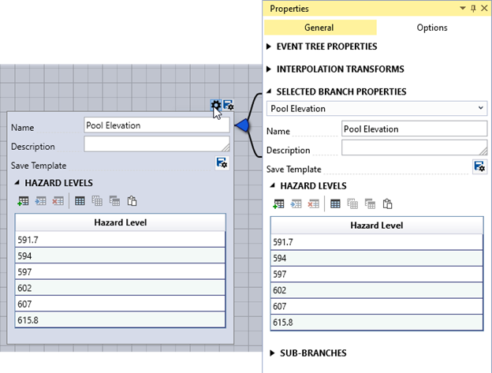
```

2.  **Enter hazard levels**. Use the table editing tools to input the desired hazard levels.

3.	**Delete the default chance node**. Remove the chance node added by default by clicking the delete button  in the toolbar, or by using the **Sub-Branches Properties** section of the initiating hazard node. Confirm the deletion when prompted by clicking **Yes**.

4.	**Add a new node**. Add the next node in the event tree using one of the following methods: Click the **Add New Branch** button  in the node toolbar, use the right-click node context menu on the node, or navigate to the **Sub-Branches Properties** section in the Properties window. After adding the node, use the **Node Properties Editor** to rename it, add a description, and define the event's probability for each hazard level specified in step 1 (Figure \@ref(fig:figure-90)). 

```{r figure-90, echo=FALSE, fig.cap="Properties for the Grass Removal probability event tree node.", fig.alt="Displays property popup window for Grass Removal node from the node tool bar icon. The window displays text boxes for name, and description; drop-downs for selecting the system response’s source and distribution, as well as the system response table at the bottom.", fig.align="center"}
knitr::include_graphics("images/figure90.png")
```

5.	**Complete the event tree**. Continue adding nodes and defining their properties until the event tree is fully developed (Figure \@ref(fig:figure-91)).

```{r figure-91, echo=FALSE, fig.cap="Completed spillway erosion event tree.", fig.alt="Displays completed event tree with Pool Elevation as the initiating hazard node; Grass Removal, Head-cut initiation, Advancement, Failure of control structure, Unsuccessful intervention, and Breach chance nodes, and the corresponding remainder nodes.", fig.align="center"}
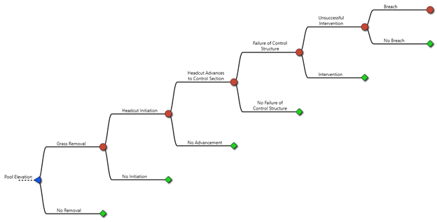
```

### Exploring Event Tree Results

The Tabbed Document contains three tabs: **Event Tree**, **Response**, and **Diagnostics**, each offering tools to explore the event tree analysis results. 

- The **Event Tree** is used to build and edit the event tree, as described in earlier sections.

- The **Response** tab displays a graphical representation of the system response function for each hazard level (Figure \@ref(fig:figure-92)). This function, commonly referred to as a fragility curve, represents the probability of failure for each defined hazard level. You can export the function data as tabular data using the **Export Plot Data** button.

```{r figure-92, echo=FALSE, fig.cap="System response probability function result from event tree.", fig.alt="A graphical representation of the system response function displaying mean and 90% confidence interval with Stage in ft on the x-axis and Conditional probability of failure on the y-axis.", fig.align="center"}
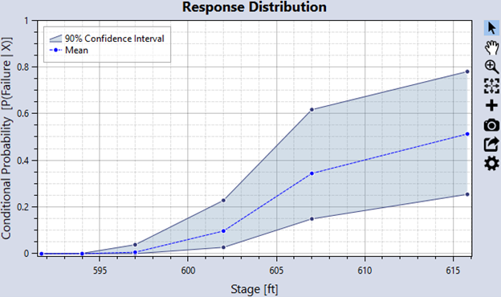
```

- The **Diagnostics** tab provides tools for reviewing and validating the event tree calculations. The left side of the Diagnostics tab offers options for **Node Filters**, **Model Parameters**, and **Plot Options** (Figure \@ref(fig:figure-93)). Details for each option are provided below.

```{r figure-93, echo=FALSE, fig.cap="Event tree diagnostic viewing options.", fig.alt="Displays Node filters check boxes; text box and drop downs for model parameters, and radio buttons for selecting plot options.", fig.align="center"}
knitr::include_graphics("images/figure93.png")
```

#### Node Filters {-}

-	**Show Remainder Nodes**: Toggles the display of remainder nodes in the results.
    
-	**Combine Remainder Leaves**: Combines terminal remainder nodes, which often represent non-failure conditions, into a single result.
    
-	**Leaf Nodes Only**: Displays only terminal leaf nodes (nodes without child branches).
 
#### Model Parameters {-}
   
-	**Monte Carlo Iterations**: Specifies the number of Monte Carlo iterations used to sample the event tree for diagnostic analysis. This option is disabled if no uncertainty is present.
    
-	**Hazard Level**: Defines the hazard level used to calculate diagnostic results. 
    
#### Plot Options {-}

-	**Event Likelihood**: Displays a box-and-whisker plot of the likelihood for each node occurring at the selected hazard level (Figure \@ref(fig:figure-94)). 
    
```{r figure-94, echo=FALSE, fig.cap="Event tree diagnostics event likelihood plot option.", fig.alt="A box-and-whisker plot displaying the likelihood on the x-axis, and each node of the event tree on the y-axis. With likelihoods of Grass removal and Head-cut initiation as almost certain, and likelihood of breach under 0.3.", fig.align="center"}
knitr::include_graphics("images/figure94.png")
```

- **Correlation to SRP**: Shows the Pearson correlation coefficients for how node probabilities correlate with the overall SRP. Chance nodes have a positive correlation with the SRP, whereas remainder nodes have a negative correlation. The absolute size of the correlation coefficient indicates the strength of the association with SRP. The nodal correlations to SRP display as a ranked tornado plot (Figure \@ref(fig:figure-95)).

```{r figure-95, echo=FALSE, fig.cap="Event tree diagnostics tree node correlation to SRP plot.", fig.alt="A ranked tornado plot displaying correlation coefficients on the x-axis and the nodes on the y-axis. The failure of control structure and head-cut advances have the highest correlation, and the Grass removal and Head-cut initiates have the lowest correlation to the overall SRP.", fig.align="center"}
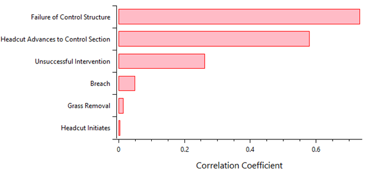
```

- **Sensitivity Index**: Displays each node’s first-order sensitivity index, indicating its contribution to the variance in the SRP (Figure \@ref(fig:figure-96)). A high sensitivity index suggests that reducing uncertainty for that node could significantly affect the overall SRP.

	
```{r figure-96, echo=FALSE, fig.cap="Event tree diagnostics tree node sensitivity indices.", fig.alt="Displaying sensitivity index on the x-axis and the nodes on the y-axis. The failure of control structure and head-cut advances have the highest sensitivity indices, and the Grass removal and Head-cut initiates have the lowest sensitivity indices.", fig.align="center"}
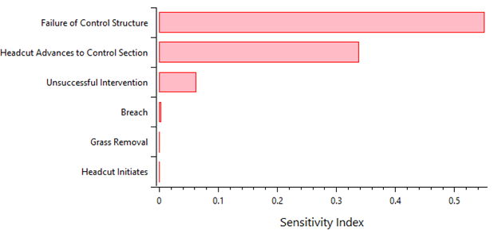
```

- **Node SRP Scatter**: Plots the sampled probabilities of a node against the overall SRP for each Monte Carlo iteration. Nodes with strong correlations to the SRP show clear trends in this scatter plot (Figure \@ref(fig:figure-97)).

```{r figure-97, echo=FALSE, fig.cap="Event tree diagnostics tree node probability to SRP scatter plot.", fig.alt="A scatter plot for Failure of Control Structure node showing a clear positive trend between the sampled node probability and the overall SRP.", fig.align="center"}
knitr::include_graphics("images/figure97.png")
```

<!-- ## Update figure to not say sampled SRP. Either computed or overall SRP -->

- **Tabular**: Displays a table of node probabilities and the overall SRP for each Monte Carlo iteration (Figure \@ref(fig:figure-98)). Use the table's column statistics feature to verify sampling distributions (Figure \@ref(fig:figure-99)).

```{r figure-98, echo=FALSE, fig.cap="Event tree diagnostics tabular output.", fig.alt="A table showing each of the individual node’s sampled probabilities and overall SRP for each Monte Carlo iteration in the model.", fig.align="center"}
knitr::include_graphics("images/figure98.png")
```

```{r figure-99, echo=FALSE, fig.cap="Column statistics for the Unsuccessful Interventions node’s sampled probabilities, confirming that the node distribution (triangular) is being sampled correctly.", fig.alt="A triangular histogram plot. Decorative.", fig.align="center"}
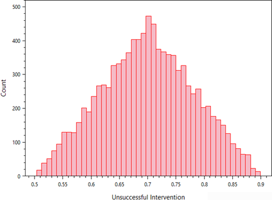
```

## Parametric Response Function

This option enables you to define a system response function using a parametric distribution. 

To create a parametric response function, right-click on the **System Responses** folder in the Project Explorer (Figure \@ref(fig:figure-100)) or go to **Project Menu > System Responses** and select **Add Parametric Response…**. Enter a name for the parametric response function and click **OK**. 

```{r figure-100, echo=FALSE, fig.cap="Create new parametric response function.", fig.alt="The Add Parametric Response option under the right-click menu of System Responses on the left, and the Parametric Response function dialog box on the right allowing the user to enter the name of the response function.", fig.align="center"}
knitr::include_graphics("images/figure100.png")
```

After creating the parametric response function, the system automatically opens it in the Tabbed Documents area, and the Properties window displays its properties (Figure \@ref(fig:figure-101)). In the Properties window, you can set the name, description, hazard type, and hazard units. Define the parametric distribution by setting the ERL, type of distribution, and parameters for the distribution. Once the parameters have been set, click the **Compute** button to generate and view the parametric response function. 

```{r figure-101, echo=FALSE, fig.cap="Parametric response function properties.", fig.alt="Displays the Distribution section of the parametric response function properties window to define the parametric distribution. There are buttons to compute the parametric hazard function and to perform bootstrap analysis at the bottom of the window.", fig.align="center"}
knitr::include_graphics("images/figure101.png")
```

Additional options for computing the parametric function are available in the Options tab on the Properties window. These include bootstrap sampling, confidence intervals, the number of realizations, a pseudo random number generator (PRNG) seed for random number generation, and output probability ordinates.

Similar to RMC-BestFit, RMC-RFA, and parametric hazard functions, you can view frequency results in graphical or tabular form. For more information on these viewing options, refer to section \@ref(bestfit).

## Tabular Response Function

This option allows you to define a system response function using tabular data. The most common use case involves copying and pasting data from another application, such as Microsoft Excel. 

To create a tabular response function, right-click on the **System Responses folder** in the Project Explorer (Figure \@ref(fig:figure-102)) or go to **Project Menu > System Responses** and select **Add Tabular Response…**. Enter a name for the tabular response function and click **OK**. 

```{r figure-102, echo=FALSE, fig.cap="Create new tabular response function.", fig.alt="The Add Tabular Response option under the right-click menu of System Responses on the left, and the Tabular Response function dialog box on the right allowing the user to enter the name of the response function.", fig.align="center"}
knitr::include_graphics("images/figure102.png")
```

Once you create the tabular response function, the system automatically opens it in the Tabbed Documents area, and the Properties window displays the tabular function's properties (Figure \@ref(fig:figure-103)). In the Properties window, you can configure the name, description, hazard type, hazard units, and hazard and probability interpolation transforms. The interpolation transforms define how the data is interpolated when sampling values between the specified tabular ordinates. 

```{r figure-103, echo=FALSE, fig.cap="Tabular response function properties.", fig.alt="The Tabular Response properties window displaying name, description, created on and last modified dates, hazard type, hazard units, and interpolation transforms.", fig.align="center"}
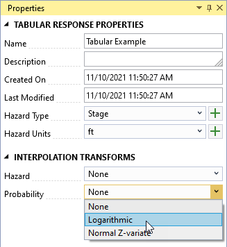
```

The Tabbed Document for a tabular response function includes a table for data entry and a graphical representation of the data (Figure \@ref(fig:figure-104)). Select a distribution to define uncertainty and enter the parameters for the selected distribution at each ordinate in the tabular data. You can input data manually into the table or paste it from an external source, such as Microsoft Excel.

```{r figure-104, echo=FALSE, fig.cap="Tabular response function example.", fig.alt="Displays the tabular response function table using PERT distribution selection from dropdown on the left and the corresponding graph with mean, median, and 90% confidence interval on the right with Stage in ft on the x-axis and Conditional probability of failure on the y-axis.", fig.align="center"}
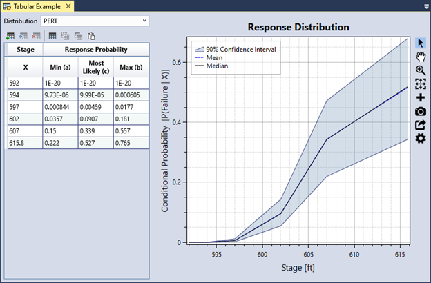
```

### Data Validation

The input data table has built-in validation. Tabular data must meet the following requirements:

-	The hazard values must be in ascending order.

-	The probability values must be between 0 and 1.

-	If uncertainty is defined, the uncertain ordinates must contain valid distribution parameters.

If you enter invalid data, the corresponding table cell turns red, and a tooltip explains the error, as shown in Figure \@ref(fig:figure-105). In addition, an error message appears in the Message window prompting you to resolve all errors in the data table. 

```{r figure-105, echo=FALSE, fig.cap="Tabular response function input data validation.", fig.alt="The stage-response probability input data table with invalid data cells turned red, and a tooltip displaying the source of the error.", fig.align="center"}
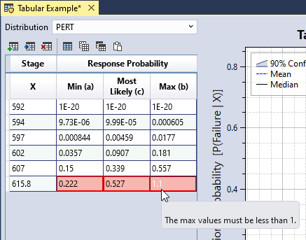
```

## Bivariate Response Function

This option enables you to define a system response function that depends on two hazards using tabular data.

To create a bivariate response function, right-click on the **System Responses** folder in the Project Explorer (Figure \@ref(fig:figure-106)) or go to **Project Menu > System Responses** and select **Add Bivariate Response…**. Enter a name for the bivariate response function and click **OK**. 

```{r figure-106, echo=FALSE, fig.cap="Create new bivariate response function.", fig.alt="The Add Bivariate Response option under the right-click menu of System Responses on the left, and the Bivariate Response function dialog box on the right allowing the user to enter the name of the response function.", fig.align="center"}
knitr::include_graphics("images/figure106.png")
```

When you create the bivariate response function, it automatically opens in the Tabbed Documents area, and the Properties window displays its properties (Figure \@ref(fig:figure-107)). From the Properties window, you can configure the name, description, primary hazard, primary hazard units, and the interpolation transforms for the primary hazard and probabilities.

Use the table tools to add the desired hazard levels for both the primary and secondary hazards, ensuring that all hazard levels are in ascending order. Assign a weight to each secondary hazard level. These weights are used during the risk computation to estimate the total system response probability for each primary hazard level. The weights must sum to 1. You can enter the weights manually or calculate them using a specified hazard function. For more details on bivariate hazard properties, refer to [@cite-TechRef].

```{r figure-107, echo=FALSE, fig.cap="Bivariate response function properties.", fig.alt="Displaying the primary hazard levels and the secondary hazard levels of the Bivariate Response function Properties window with Primary hazard levels specified as Stage, and the secondary hazard specified as PGA-Frequency. There is a check box for manually entering the weights.", fig.align="center"}
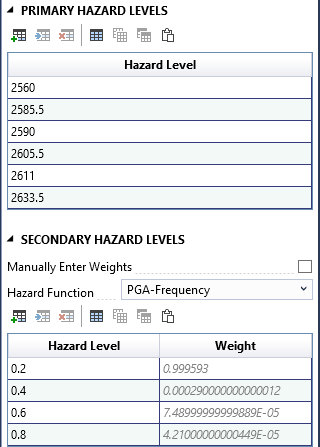
```

As you input primary and secondary hazard levels in the Properties window, the table at the top of the Tabbed Document automatically updates, with each row representing a primary hazard level and each column representing a secondary hazard level (Figure \@ref(fig:figure-108)). To complete the bivariate response function, enter the probability of failure in each cell based on the combination of the primary hazard (row) and secondary hazard (column). A graphical representation of the system response functions for each secondary hazard level appears below the table.

```{r figure-108, echo=FALSE, fig.cap="Bivariate response function graphical display.", fig.alt="Displays a table with the primary hazard levels in rows and the secondary hazard levels in columns. The plot below has lines corresponding to each secondary hazard level as well as a weighted line. The primary hazard, Stage in ft is on the x-axis and Conditional probability of failure on the y-axis.", fig.align="center"}
knitr::include_graphics("images/figure108.png")
```

## Composite Response Function

This option allows you to combine multiple response functions into a single function by assigning weights to the individual input functions.

To create a composite response function, right-click on the **System Responses** folder in the Project Explorer (Figure \@ref(fig:figure-109)) or navigate to **Project Menu > Hazards** and **select Add Composite Response…**. Enter a name for the composite response function and click **OK**. 

```{r figure-109, echo=FALSE, fig.cap="Create new composite response function.", fig.alt="The Add Composite Response option under the right-click menu of System Responses on the left, and the Composite Response function dialog box on the right allowing the user to enter the name of the response function.", fig.align="center"}
knitr::include_graphics("images/figure109.png")
```

After creating the composite response function, it automatically opens in the Tabbed Documents area, and the Properties window displays its properties (Figure \@ref(fig:figure-110)). In the Properties window, you can configure the name, description, hazard type, hazard units, and input response functions. Use the Response Functions table to define the input functions. Click the Add Row(s) button in the table toolbar to add rows for the input functions. Ensure that the response function weights sum to 1. If the system response functions are competing, uncheck the **Is Mixture** checkbox and select a **Dependency** type: Independent, Perfectly Positive, or Perfectly Negative.

```{r figure-110, echo=FALSE, fig.cap="Composite response function properties.", fig.alt="Displays the Response Function section of the Composite response function properties window with a check box for Is Mixture and dropdowns for selecting response function levels and corresponding text boxes for entering the weights for each level of the response function.", fig.align="center"}
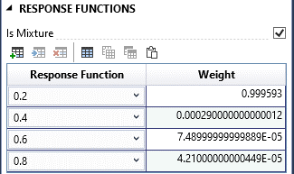
```

The Tabbed Document for a composite function includes a graphical representation of the composite function (Figure \@ref(fig:figure-111)).

```{r figure-111, echo=FALSE, fig.cap="Composite response function graphical display.", fig.alt="The composite response distribution plot displays lines corresponding to each secondary hazard level as well as a Mean line. The primary hazard, Stage in ft is on the x-axis and Conditional probability of failure on the y-axis.", fig.align="center"}
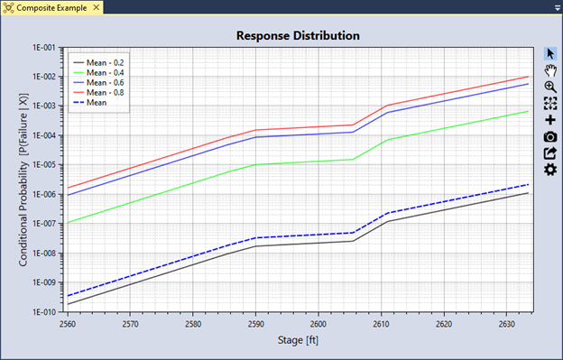
```
