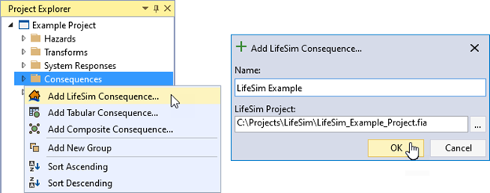
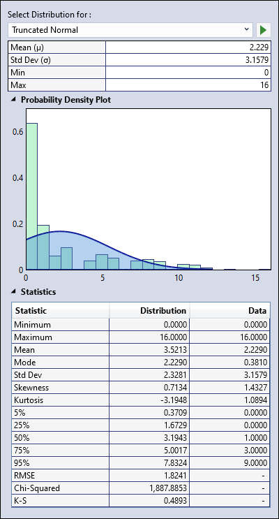
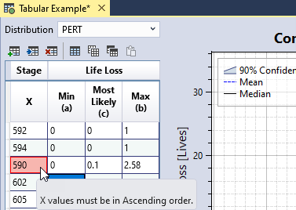

# Consequence Functions

Consequence functions in RMC-TotalRisk quantify the magnitude of consequences that arise from a given range of hazards. These functions estimate how much life loss or economic damage to expect based on a hazard level and the associated system response. Dam and levee safety risk analyses typically define consequence functions separately for each PFM because the consequences can vary depending on the failure mode being assessed. For example, an overtopping failure mode typically provides more warning time than an earthquake-driven failure, resulting in different life loss estimates.

You can define consequence functions in RMC-TotalRisk by importing them directly from a LifeSim version 2.0 model, specifying a tabular function, or creating a composite function. The following subsections describe each consequence function option in detail.

## Import from LifeSim

The USACE RMC, in collaboration with the HEC, developed the LifeSim software for estimating life loss and economic damage [@cite-LifeSimManual]. LifeSim is an agent-based system that simulates population redistribution during evacuation and evaluates consequences based on the hazard (e.g., flooding) [@cite-Fields2016]. You can download LifeSim from the [RMC website](https://www.rmc.usace.army.mil/Software/LifeSim/) and import its analysis results directly into RMC-TotalRisk. 

To import LifeSim analysis results, right-click on the **Consequences** folder in the Project Explorer (Figure \@ref(fig:figure-112)) or go to **Project Menu > Consequences** and select **Add LifeSim Consequence…**. Enter the consequence function name and select the LifeSim project file with the desired results (Figure \@ref(fig:figure-112)). Next, click **OK**  to import the LifeSim study results.

```{r figure-112, echo=FALSE, fig.cap="Create new LifeSim consequence function.", fig.alt="The Add LifeSim Consequence option under the right-click menu of Consequences on the left, and the LifeSim Consequence function dialog box on the right allowing the user to enter the name of the consequence function and select the LifeSim project file.", fig.align="center"}

```

Creating the new LifeSim consequence function opens the Tabbed Documents area, and the Properties window displays the function properties (Figure \@ref(fig:figure-113)). From here, you can set the name, description, hazard type, hazard units, and hazard and consequence interpolation transforms. These interpolation transforms define how the data is interpolated when sampling values between the specified LifeSim results. 

The **LifeSim Results** section of the Properties window contains three key parameters: 

- **Consequence** determines what type of consequence to select from the LifeSim results. The options are Life Loss and $ Damages.

- **Starting Hazard** is the hazard level where consequences begin. This parameter provides a lower bound for the consequence function. The starting hazard level must be below the lowest value in the imported LifeSim results.

- **Combine Zones**, if checked, combines selected LifeSim results from the entire simulation area. If unchecked, you need to select specific summary zones (regions) from LifeSim results. LifeSim can geographically separate results by summary zone, allowing flexibility when creating consequence functions.

```{r figure-113, echo=FALSE, fig.cap="LifeSim consequence function properties.", fig.alt="Displays the LifeSim Consequence function Properties window with LifeSim consequence properties, interpolation transforms, and LifeSim results sections of the inputs.", fig.align="center"}
knitr::include_graphics("images/figure113.png")
```

The LifeSim consequence function is created in the Tabbed Document (Figure \@ref(fig:figure-114)). Use the table on the left to enter hazard levels (e.g., reservoir pool elevations or river flows) and LifeSim simulation results. A graphical representation of the function displays to the right of the table. 

Follow these steps to enter each LifeSim result:

1. Use the table tools to add rows for each desired hazard level. The hazard levels must be in ascending order. 

2. For each defined hazard level, select a LifeSim simulation result from the dropdown menu(s). Navigate the LifeSim results more easily by using the **Filtered View** check box to filter the cell contents to only contain results from the selected simulations/alternatives/times of day. For example, in Figure \@ref(fig:figure-114) the only options in the alternative column are from the future without project (FWOP) simulations and the available hazard time(s) are based on the selected simulation-alternative combination.

```{r figure-114, echo=FALSE, fig.cap="LifeSim consequence function tabbed document.", fig.alt="Displays a filtered view of LifeSim simulation results for a selected simulation-alternative combination in a table on the left and a graphical representation of the consequence function on the right. In the foreground, a popup window shows the selected distribution for a hazard level.", fig.align="center"}
knitr::include_graphics("images/figure114.png")
```

3. Once you select a LifeSim simulation result, multiple distributions auto-fit to the data and a truncated normal distribution represents potential consequences with uncertainty at the specified hazard level. To view, change, or edit the selected distribution click the button in the distribution column cell. A popup (Figure \@ref(fig:figure-115)) shows the selected distribution, the distribution’s PDF, and a histogram of the LifeSim results data for a visual comparison of the distribution fit. Summary statistics are provided for both the selected distribution and the LifeSim results data, including goodness of fit tests for the distribution and the data.

```{r figure-115, echo=FALSE, fig.cap="LifeSim result distribution selector control.", fig.alt="The window displays the selected distribution details at the top, and a plot of the distribution’s PDF overlayed on a histogram of the LifeSim results in the middle and the summary statistics for both the selected distribution and the LifeSim results data in a table at the bottom.", fig.align="center"}

```

## Tabular Consequence Function

This option allows you to define a consequence function using tabular data. A common use case involves copying and pasting data from another application, such as Microsoft Excel.

To create a tabular consequence function, right-click on the **Consequences** folder in the Project Explorer (Figure \@ref(fig:figure-116)) or navigate to **Project Menu > Consequences** and select **Add Tabular Consequence…**. Enter a name for the tabular consequence function and click **OK**.

```{r figure-116, echo=FALSE, fig.cap="Create new tabular transform function.", fig.alt="The Add Tabular Consequence option under the right-click menu of Consequences on the left, and the Tabular Consequence function dialog box on the right allowing the user to enter the name of the consequence function.", fig.align="center"}
knitr::include_graphics("images/figure116.png")
```

Creating the new tabular consequence function opens the Tabbed Documents area, and the Properties window displays the tabular function properties (Figure \@ref(fig:figure-117)). In the Properties window, you can set the name, description, hazard type, hazard units, consequence, consequence unit, and hazard and consequence interpolation transforms. These interpolation transforms define how the data is interpolated when sampling values between the specified tabular ordinates. 

```{r figure-117, echo=FALSE, fig.cap="Tabular consequence function properties.", fig.alt="The Tabular consequence properties window displaying name, description, created on and last modified dates, hazard type, hazard units, consequence, consequence units, and interpolation transforms input fields.", fig.align="center"}
knitr::include_graphics("images/figure117.png")
```

The Tabbed Document for the tabular consequence function contains the table to enter data and a graphical representation of that data (Figure \@ref(fig:figure-118)). Define uncertainty around the consequence for each tabular ordinate. Select a distribution to define uncertainty and enter parameters for the selected distribution for every ordinate in the tabular data. You can enter data manually into the table or paste it from another source such as Microsoft Excel.

```{r figure-118, echo=FALSE, fig.cap="Tabular consequence function example.", fig.alt="Displays the tabular consequence function table using PERT-Percentile distribution selection from dropdown on the left and the corresponding graph with mean, median, minimum, maximum, and 90% confidence interval on the right with Stage in ft on the x-axis and Life Loss in lives on the y-axis.", fig.align="center"}

```

### Data Validation

The input data table has built-in validation. Tabular data must meet the following requirements:

- Hazard values must be in ascending order.

- If uncertainty is defined, each uncertain ordinates must contain valid distribution parameters.

When you enter invalid data, the table cell turns red and a tooltip indicates the source of the error, as shown in Figure \@ref(fig:figure-119). In addition, an error message appears in the Message window, prompting you to resolve all errors in the data table. 

```{r figure-119, echo=FALSE, fig.cap="Tabular consequence function data validation.", fig.alt="The Stage-Life Loss input data table with invalid data cells turned red, and a tooltip displaying the source of the error.", fig.align="center"}

```

## Composite Consequence Function

This option combines multiple consequence functions into a single function by weighting the individual input functions, averaging them, or adding them. Common use cases include combining a daytime consequence function with a nighttime function by weighting them or aggregating damage functions by structure damage category into a single damage function by adding them.

To create a composite consequence function, right-click on the **Consequences** folder in the Project Explorer (Figure \@ref(fig:figure-120)) or go to **Project Menu > Consequences** and select **Add Composite Consequence…**. Enter a name for the composite consequence function and click **OK**. 

```{r figure-120, echo=FALSE, fig.cap="Create new composite consequence function.", fig.alt="The Add Composite Consequence option under the right-click menu of Consequences on the left, and the Composite Consequence function dialog box on the right allowing the user to enter the name of the consequence function.", fig.align="center"}

```

Creating the new composite consequence function opens the Tabbed Documents area, and the Properties window displays the composite function properties (Figure \@ref(fig:figure-121)). In the Properties window, you can set the name, description, hazard type, hazard units, consequence, consequence unit, hazard and consequence interpolation transforms, composite type, and input consequence functions. 

```{r figure-121, echo=FALSE, fig.cap="Composite consequence function properties.", fig.alt="The Composite consequence properties window displaying tabular consequence properties section, interpolation transforms section, and consequence functions section for specifying composite type, selection for consequence functions and text boxes for specifying their weights.", fig.align="center"}
knitr::include_graphics("images/figure121.png")
```

Choose one of the following options to define how the input functions are combined: 

- **Additive** adds the input functions together without requiring weights.

-	**Average** combines the input functions and their uncertainties using a weighted average. The weights must sum to one.

-	**Mixture** combines the input functions and their uncertainties as a mixture. The weights must sum to one. This method produces the same mean as the average method but with wider uncertainty bands in the composite function.

To select input functions for the composite, use the **Consequence Functions** table. Click the **Add Row(s)** button in the table toolbar to add new rows for the input functions.

The Tabbed Document for a composite function includes a graphical representation of the composite function (Figure \@ref(fig:figure-122)).

```{r figure-122, echo=FALSE, fig.cap="Composite consequence function graphical display.", fig.alt="Displays the Composite consequence function graph with Day and Night life loss with mean, median, and 90% confidence interval. The Stage in ft is on the x-axis and Life Loss in lives is plotted on the y-axis.", fig.align="center"}
knitr::include_graphics("images/figure122.png")
```

