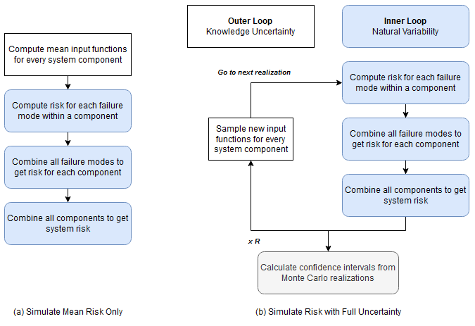

# Risk Analyses

In RMC-TotalRisk, you can conduct a risk analysis for a system with up to 20 system components. Each component requires three fundamental inputs: a hazard function, a system response function, and a consequence function. Transform functions are optional.

A risk analysis must include at least one system component. You can use multiple components to represent either different structures within the system or various hazard types affecting a single structure.

Each system component can include multiple system response functions, commonly referred to as failure modes. These failure modes may lead to different consequences. For example, in a dam scenario, a seepage failure mode might progress slowly, allowing downstream populations more time to evacuate. In contrast, a seismic failure mode could cause rapid failure, providing little evacuation time. At least one failure mode is necessary to calculate excess, failure, and total risks.

A system component can include only one non-failure mode. This mode does not require a response function but is essential for calculating excess, non-failure, background, and total risks. If a non-failure mode is not provided, the risk calculations assume the non-failure consequences are zero. 

To compute risk, a system component must include either a failure mode or a non-failure mode.

For more information on the quantitative risk analysis framework in RMC-TotalRisk, refer to the technical reference manual [@cite-TechRef].

## Create New Risk Analysis

To create a risk analysis, right-click on the **Risk Analyses** folder in the Project Explorer (Figure \@ref(fig:figure-123)) or navigate to **Project Menu > Risk Analyses** and select **Add Risk Analysis…**. Enter a name for the risk analysis and click **OK**.

```{r figure-123, echo=FALSE, fig.cap="Create a new risk analysis.", fig.alt="The Add Risk Analysis option under the right-click menu of Risk Analyses on the left, and the Risk Analysis dialog box on the right allowing the user to enter the name of the Risk Analysis.", fig.align="center"}
knitr::include_graphics("images/figure123.png")
```

When you create a new risk analysis, it automatically opens in the Tabbed Documents area, and the Properties window displays the risk analysis properties (Figure \@ref(fig:figure-124)). In the Properties window, you can configure the name, description, consequence type, and consequence units. The consequence type and units are required, and all consequence functions in the analysis must match the selected consequence type.

You can access additional risk analysis options through the Options tab in the Properties window (Figure \@ref(fig:figure-124)). For most applications, the default risk analysis options provide reasonable results. The following sections explain the available risk analysis options in detail.
 
```{r figure-124, echo=FALSE, fig.cap="Risk analysis properties (general properties at left; risk analysis options at right).", fig.alt="The General tab window displayed on the left has the Risk Analysis Properties and the Simulations settings section and the Estimate button at the bottom; and the Options tab window displayed on the right has Simulation, Integration, System Component, System, and Risk Measures sections.", fig.align="center", out.width="85%"}
knitr::include_graphics("images/figure124.png")
```

## Simulation Options

The simulation options allow you to configure settings for the uncertainty analysis and the loss exceedance curve (LEC) results (Figure \@ref(fig:figure-125)). 

```{r figure-125, echo=FALSE, fig.cap="Risk analysis simulation options.", fig.alt="Simulation options display dropdowns to select width of the confidence interval, and the number of Monte Carlo simulation realizations; and text boxes to specify pseudo random number generator seed value, and loss exceedance curve output length.", fig.align="center"}
knitr::include_graphics("images/figure125.png")
```

-	**Confidence Interval**: Specifies the width of the confidence interval (CI). For a 90% CI, the value of interest has a 90% probability of falling within the interval. CIs are computed only after simulating risk with full uncertainty. The default CI is 90%.

-	**Realizations**: Sets the number of Monte Carlo simulation realizations for simulating risk with full uncertainty. The default is 1,000 realizations, balancing reasonably accurate CIs with shorter runtimes. The maximum allowed number of realizations is 10,000 due to runtime and file size constraints. Running 10,000 realizations is recommended for the most accurate results, although minor sampling errors in mean risk results and percentiles may still occur.

-	**PRNG Seed**: Defines the pseudo random number generator (PRNG) seed value for the Monte Carlo simulation. Using the same seed value ensures repeatable results, while changing the seed value alters the sequence of random numbers used in the simulation.

-	**LEC Output Length**: Specifies the number of points used to construct the LECs. An LEC displays risk results with consequences on the x-axis and exceedance probability on the y-axis. Using at least 200 points is recommended to enhance the accuracy of the curves.


## Integration Options

RMC-TotalRisk uses numerical integration to compute risk for each Monte Carlo realization.

When the risk analysis has a single system component, the **Adaptive Simpson’s Rule (ASR)** performs the numerical integration. Figure \@ref(fig:figure-126) shows the available options for the ASR method.

```{r figure-126, echo=FALSE, fig.cap="Risk analysis integration options when there is single system component.", fig.alt="Integration options window displaying text boxes to enter values for maximum number of integrand evaluations, maximum recursion depth, and desired tolerance. There is also a check box for using defaults.", fig.align="center"}

```

- **Max Evaluations**: Specifies the maximum number of integrand evaluations allowed during numerical integration. The value must be between $10,000$ and $1,000,000$, with a default of $1,000,000$.

- **Max Depth**: Sets the maximum recursion depth for ASR integration. The default is $100$.

- **Tolerance**: Defines the desired tolerance for the ASR integration. This setting applies to the mean of the total system risk, with a default value of $10^{-8}$. 

When the risk analysis includes two or more system components and the **Joint System Risk Method** is selected, the adaptive importance sampling method **VEGAS** handles numerical integration. Figure \@ref(fig:figure-127) shows the available options for the VEGAS method.

```{r figure-127, echo=FALSE, fig.cap="Risk analysis integration options when there are multiple system components and the joint system risk method is selected.", fig.alt="Integration options window displaying text boxes to enter values for maximum number of integrand evaluations, number of integrand evaluations each warmup cycle, number of warmup cycles, and final number of integrand evaluations. There is also a check box for using defaults.", fig.align="center"}
knitr::include_graphics("images/figure127.png")
```

- **Max Evaluations**: Specifies the maximum number of integrand evaluations allowed during numerical integration. The value must be between $10,000$ and $1,000,000$, with a default of $1,000,000$.

- **Warmup Evaluations**: Determines the number of integrand evaluations per warmup cycle. The default is $1,000 \times D$, where $D$ is the number of integrand dimensions (i.e., system components). 

- **Warmup Cycles**: Sets the number of warmup cycles for the adaptive importance sampling method. The default is $5$. 

- **Final Evaluations**: Specifies the number of integrand evaluations performed after completing the warmup phase. The default is $10,000$. 

For more details on the numerical integration methods used by RMC-TotalRisk, refer to the technical reference manual [@cite-TechRef].

## System Component Options

Figure \@ref(fig:figure-128) shows the system component options.

```{r figure-128, echo=FALSE, fig.cap="Risk analysis system component options.", fig.alt="Displays options for selecting system component, name editable by the user, dropdown selections for failure mode method, joint consequences, failure dependency, and profile hazard function, and a text box for entering a hazard threshold value.", fig.align="center"}
knitr::include_graphics("images/figure128.png")
```

-	**System Component**: A system component consists of three key inputs: the hazard, the system response to that hazard, and the consequences given the response and hazard. By default, the system component is identified and labeled by the selected hazard function, which can only be used once per risk analysis. A single risk analysis is limited to 20 system components due to virtual memory and runtime constraints. Several options are available to customize how the risk analysis computes each system component.

-	**Name**: Users can edit the name of the selected system component. 

-	**Failure Mode Method**: This setting determines how the risk analysis accounts for multiple failure modes. Options include **joint**, **competing**, **common cause**, and **mutually exclusive** failures. Note: The **joint** and **competing** methods are computationally intensive and are limited to 20 failure modes. 

    -	**Joint** (default): Use this method when multiple failure modes can occur simultaneously during the same event. This method requires selecting a joint consequence rule. 

    -	**Competing**: Use this method when joint failures are not possible because the system component fails when the first of the competing failure modes reaches a failure state. The system response functions’ capacity automatically determines the failure mode order. Ensure that the system response functions increase monotonically.

    -	**Common Cause**: This method assumes a common cause initiates multiple failure modes, but joint failures are not possible. While included for backward compatibility with existing risk analysis software, use the competing method when feasible.

    -	**Mutually Exclusive**: Use this method when failure modes are disjoint (have no intersection) and cannot occur simultaneously. During the risk analysis, response probabilities exceeding 1 at a given hazard level are normalized.

-	**Joint Consequences**: This setting applies to the joint failure mode method and determines how joint failure consequences are treated. Options include **additive**, **average**, **maximum** (default), and **minimum**. 

    -	Use **additive** when failure modes affect different inundation areas, and the total consequences are best represented by adding consequences for each area. 

    -	Use **average** when inundation areas are partially overlapping.

    -	Use **maximum** when failure modes share the same inundation area to avoid overestimating consequences.

    -	Use **minimum** as a sensitivity or to establish a lower bound for risk. 

-	**Failure Dependency**: This option sets the statistical dependency between failure modes within the selected system component. It is unavailable for the mutually exclusive method. The dependency influences the joint probability of the response functions. The options include **independent** (default), **perfectly positive**, **perfectly negative**, or a user-defined **correlation matrix**. 

    -	The **Correlation Matrix** option becomes available when you select it as the dependency method. Clicking the button opens a table where you can enter correlation coefficients between failure modes. 
    

-	**Profile Hazard**: This option sets the hazard function used to construct risk profiles and estimate the probability of exceeding a hazard threshold. You can select the primary hazard function or any hazard-to-response transform functions. For levee accreditation analyses, use stage or water surface elevation as the profile hazard type.

-	**Hazard Threshold**: This setting defines the hazard level for calculating the probability of exceeding that threshold. The default hazard threshold is 0. For levee accreditation analyses, use the top of levee stage or elevation as the hazard threshold. 

## System Options

The system options define how the system components interact in the risk calculations (Figure \@ref(fig:figure-129)). 

```{r figure-129, echo=FALSE, fig.cap="Risk analysis system options.", fig.alt="Risk analysis system options window displaying dropdown options for selecting system risk method, joint consequences, and hazard dependency.", fig.align="center"}
knitr::include_graphics("images/figure129.png")
```

-	**System Risk Method**: This option determines how the analysis calculates system risk. The available methods are **additive** and **joint risk**: 

    -	**Additive Risk Method** (default): Assumes system components are independent, and their consequences can be summed. This method has shorter runtimes but does not generate system-level loss exceedance curves (LECs) and computes fewer system-wide risk measures.
    
    -	**Joint Risk Method**: Allows modeling dependencies between components and generates a complete set of system risk outputs, including system-level LECs and more comprehensive risk measures. However, this method typically has longer runtimes.
    
-	**Joint Consequences**: Defines how the risk analysis handles the consequences of joint events among system components. Options include **additive**, **average**, **maximum** (default), and **minimum**.

    -	Use **additive** when the system components have nonoverlapping inundation areas, where summing consequences is more appropriate. 

    -	Use **average** when inundation areas partially overlap, and averaging the consequences is appropriate.

    -	Use **maximum** when modeling various hazard types affecting a single structure to prevent overestimating the consequences.

    -	Use **minimum** as a sensitivity or to establish a lower bound for system risk. 

-	**Hazard Dependency**: Specifies the statistical dependency between system component hazards in the risk analysis. This option is only available for the joint risk method. The dependency influences the joint probability of the hazard functions. Options include **independent** (default), **perfectly positive**, **perfectly negative**, or a user-defined **correlation matrix**.

    -	The **Correlation Matrix** option becomes available when you select it as the dependency method. Clicking the button opens a table where you can enter correlation coefficients between system component hazard functions. 

## Risk Measure Options

RMC-TotalRisk offers additional risk measures that are valuable for the risk-based design of engineering structures. These measures are calculated for the entire system rather than individual components. Figure \@ref(fig:figure-130) displays the risk measure options.

```{r figure-130, echo=FALSE, fig.cap="Risk measure options.", fig.alt="Risk measures options window displaying text boxes for entering consequence threshold and alpha values.", fig.align="center"}
knitr::include_graphics("images/figure130.png")
```

-	**Consequence Threshold**: Specifies the consequence level for calculating the probability of exceeding that threshold. The default consequence threshold is $0$.

-	**Alpha** Sets the exceedance probability used to compute the Value-at-Risk (VaR) and Conditional Value-at-Risk (CVaR). The default exceedance probability is $10^{−2}$.

For more details about the additional risk measures in RMC-TotalRisk, refer to the technical reference [@cite-TechRef].

## Risk Diagram

RMC-TotalRisk defines a risk analysis using an intuitive diagram, as shown in Figure \@ref(fig:figure-131). This diagram provides a clear way to create and connect the components of the modeled system. 

A risk analysis computes the risk associated with multiple potential failure modes for each system component. Each failure mode combines a hazard, the system's response to that hazard, and the consequences of the response. Non-failure modes consist of a hazard and the non-failure consequences associated with it.

Figure \@ref(fig:figure-131) illustrates a single system component for a dam safety risk analysis. The diagram includes a non-failure mode, represented by the purple line at the top, connecting the hazard function directly to the non-failure consequences without involving a system response. Many dams experience non-failure consequences. For example, during a major flood event, a dam might activate its emergency spillway to prevent overtopping. While this action protects the dam, it can still result in downstream impacts. The non-failure mode in the diagram represents the risk associated with these non-failure scenarios. 

The diagram also includes two failure modes:

1.	**Spillway erosion failure mode (PFM 1)**: This mode, shown in the center of the diagram, connects the hazard function at Dam A to the PFM 1 response function and consequence function.

2.	**Concentrated leak erosion failure mode (PFM 2)**: This mode, shown at the bottom of the diagram, follows the same structure as PFM 1. 

```{r figure-131, echo=FALSE, fig.cap="RMC-TotalRisk risk diagram.", fig.alt="Risk diagram for a single system component showing Stage-Frequency hazard connected with Non-failure consequences, and with response functions for two failure mode and their respective consequence functions.", fig.align="center"}
knitr::include_graphics("images/figure131.png")
```

The risk diagram connects input functions from left to right, linking them based on their hazard type (e.g., stage, flow) and units (e.g., ft, cfs). Circular or redundant connections are not allowed, making the risk diagram a type of directed acyclic graph (DAG).

System components in the diagram are labeled by their selected hazard functions. You can rename system components by right-clicking their names in the diagram or editing their names in the Properties window. Failure modes within each component are labeled by their corresponding response functions.

RMC-TotalRisk supports an unlimited number of failure modes per component, depending on the selected failure mode method. However, a single system is limited to 20 components due to virtual memory and runtime constraints. For example, you can evaluate the system risk for a watershed with up to 20 dams, each containing multiple failure modes.

### Working with the Risk Diagram

First, familiarize yourself with the diagram interface. Pan the diagram surface by left-clicking and dragging on any open area. Zoom in and out using the mouse wheel.

Nodes in the diagram represent inputs to the risk analysis. Select a node's input function using the selection box. Move a node by left-clicking and dragging it. A blue circle at the bottom left of a node indicates required inputs, while an orange circle at the lower right shows the node output (Figure \@ref(fig:figure-132)). 
```{r figure-132, echo=FALSE, fig.cap="Risk diagram node inputs and outputs.", fig.alt="Response and consequence nodes for PFM 1 are connected using a green line. The node inputs and outputs are shown by a blue-colored circle and an orange-colored circle respectively.", fig.align="center"}
knitr::include_graphics("images/figure132.png")
```
#### Adding Nodes {-}
You can add nodes to the risk diagram in three ways (Figure \@ref(fig:figure-133)): 

1. Hover over the large plus symbol in the upper-left corner of the diagram, then left-click and drag the node to the desired location.

2. Right-click on any empty space in the diagram to open a selection box and add a node at that location.

3. Left-click on a node output to open a selection box. This option automatically connects the new node to the clicked node output.

```{r figure-133, echo=FALSE, fig.cap="Options to add a new input node to the risk diagram: a) Place the cursor over the plus symbol in the upper left corner of the diagram then move the node to the desired location; b) Right-click on any empty space in the diagram to add at that location; and c) left-click on a node output (this option also connects the nodes).", fig.alt="Decorative.", fig.align="center", out.width="90%"}
knitr::include_graphics("images/figure133.png")
```

#### Connecting Nodes {-}
To connect two nodes, left-click and hold on a node output, then drag the cursor toward the desired node input. Release the mouse button to create the connection (Figure \@ref(fig:figure-134)).

```{r figure-134, echo=FALSE, fig.cap="To connect a node to another node, left-click and hold on a node output, drag toward the desired node input, and release the mouse button to finish the connection.", fig.alt="Decorative.", fig.align="center"}
knitr::include_graphics("images/figure134.png")
```

#### Deleting and Disconnecting Nodes {-}

To delete a node, right-click on it and select **Delete**, or click the **X** that appears in the top-right corner when you hover over the node. To disconnect two nodes, left-click and hold the input of the connected node, then drag the cursor to another node’s input or click any open space in the diagram.

#### Node Types {-}

The diagram has four fundamental node types:

- &nbsp;**Hazard Node**: Describes exceedance probabilities for various hazard levels (e.g., peak flow-frequency or reservoir stage frequency). Hazard nodes define the system component’s identity and can have multiple outputs.
 	
- &nbsp;**Transform Node**: Converts hazard levels from one type to another (e.g., flow to stage). Transform nodes can connect sequentially and have multiple outputs unless linked to a response function. For example, an unregulated flow-frequency function may need to be transformed into regulated flow and then transformed again from flow to stage to assess probability of failure on hydraulic structures downstream.
 	
- &nbsp;**Response Node**: Represents the system’s conditional probability of failure at various hazard levels. Response nodes define failure modes and allow one output connection.
 	
- &nbsp;**Consequence Node**: Defines the consequences of failure or non-failure. Non-failure consequences connect directly to the hazard node without a response function.

#### Visual Feedback {-}

The diagram provides visual feedback for data validation:

- &nbsp;**No Input Selected**: Red outlines indicate a node with no input defined.

- &nbsp;**Incomplete Connection**: Black lines indicate valid connections that lack complete failure or non-failure modes. The risk calculations will not include this connection.
 	
- &nbsp;**Invalid Connection**: Red lines indicate mismatched units or undefined inputs. Invalid connections prevent risk analysis.
 	
- &nbsp;**Valid Non-Failure Mode Connection**: Purple lines indicate valid non-failure mode connections. A system component with complete non-failure mode connections is included in the risk calculations.

#### Example Levee Risk Diagram {-}

Figure \@ref(fig:figure-135) illustrates a levee risk analysis. The hazard function is a river peak flow frequency curve, transformed into a peak river stage using a flow-to-stage rating curve from a hydraulic routing model. The diagram includes two failure modes:

- **Prior OT (Backward Erosion Piping)**: Represents failure before overtopping.

- **OT (Overtopping)**: Represents overtopping-related failure.

The non-failure mode is represented at the top with purple connectors, where non-failure consequences connect directly to the hazard transform function.

```{r figure-135, echo=FALSE, fig.cap="Example levee risk diagram.", fig.alt="Decorative.", fig.align="center"}
knitr::include_graphics("images/figure135.png")
```

## Risk Simulation

Once you have created a risk analysis and configured the desired options, you can run a risk simulation. Choose between two simulation methods (Figure \@ref(fig:figure-riskprop)):

- **Simulate Mean Risk Only** (default): This method uses the mean result from each input function to compute risk.

- **Simulate Risk with Full Uncertainty**: This method employs Monte Carlo simulation to estimate risk using the full range of uncertainty from each input function

To calculate a risk estimate, click the **Estimate** button.

```{r figure-riskprop, echo=FALSE, fig.cap="Risk simulation options.", fig.alt="Decorative.", fig.align="center"}
knitr::include_graphics("images/riskproperties.png")
```

Figure \@ref(fig:figure-risksim) illustrates the overall risk and Monte Carlo simulation framework used in RMC-TotalRisk. The **Mean Risk Only** method is computationally efficient and can be completed in a single loop, as shown on the left side of the figure. However, this method approximates risk and may not fully capture combinations of low-probability, high-consequence events. Consequently, it can underestimate variance and tail risk.

For scenarios involving significant uncertainty in extreme events, it is recommended to use the **Simulate Risk with Full Uncertainty** option for a more accurate assessment.

For a detailed explanation of the risk analysis framework, simulation options, algorithms, and underlying mathematics, refer to the technical reference manual [@cite-TechRef].

```{r figure-risksim, echo=FALSE, fig.cap="Flowchart of the TotalRisk simulation options: (a) Simulate mean risk only, and (b) Simulate risk with full uncertainty.", fig.alt="Decorative.", fig.align="center", out.width="95%"}

```
