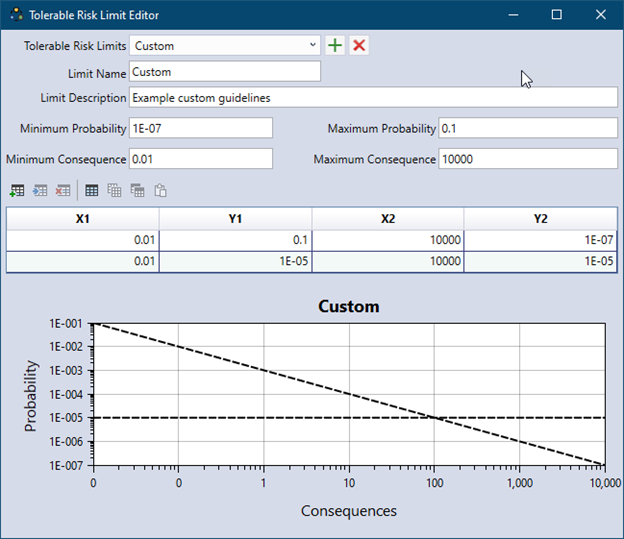

# Risk Analysis Results

Three tabs provide different views of the risk analysis results: the **Loss Exceedance Plot**, **Conditional Loss Plot**, and **Summary Statistics** tabs (Figure \@ref(fig:figure-136)). The first two tabs display the risk analysis results graphically, while the last presents results in tabular form. 

```{r figure-136, echo=FALSE, fig.cap="Risk results tabs.", fig.alt="Loss Exceedance Plot, Conditional Loss Plot, and Summary Statistics tabs shown with a red box around them.", fig.align="center"}

```

Each risk result tab includes options to filter the results. To filter results, click the button next to **Filter Results** near the top of the tab. Use the checkboxes (Figure \@ref(fig:figure-137)) to select which risk components and types to display in both graphical and tabular results. Risk components include the overall system, all system components, and all failure modes within each component. 

```{r figure-137, echo=FALSE, fig.cap="Select checkboxes for risk type and the system component in the graphical and tabular risk results.", fig.alt="The Loss Exceedance Plot tab in the Risk Analysis window with check boxes for selecting the risk types, alternatives, risk analyses, and failure modes.", fig.align="center"}

```

RMC-TotalRisk reports five types of risk, calculating each for a range of probable hazard events:

- **Excess Risk**: Represents the risk of system failure, calculated using the probability of the hazard, the probability of failure, and the excess consequences. Excess consequences refer to the additional losses or damages caused by failure, beyond those that would occur during the same event if the structure did not fail. 

- **Background Risk**: Represents the risk assuming no structural flaws or vulnerabilities in the system. It reflects the risk from natural hazards alone, without accounting for the potential impacts of structural deficiencies.

- **Total Risk**: Represents the overall risk of the system (or component) and is calculated as the sum of failure risk and non-failure risk. Some USACE publications refer to total risk as residual risk (i.e., the risk that remains) [@cite-EM1619] [@cite-ER1156]. Proper estimation considers all potential hazard sources, their likelihoods of occurrence, and their potential consequences. 

- **Failure Risk**: Represents the risk associated with system failure, calculated based on the probability of the hazard, the probability of failure, and the consequences of failure.

- **Non-Failure Risk**: Represents the risk associated with the system not failing, calculated using the probability of the hazard, the probability of non-failure, and the consequences of non-failure. Infrastructure such as dams and levees often incurs consequences even when it does not fail. For example, during a major flood event, a dam might activate its emergency spillway, preventing the dam from reducing downstream flooding.

Dam and levee risk assessments often emphasize a limited range of flood and seismic hazard levels that could lead to failure, potentially overlooking the broader range of hazard levels that result in non-failure consequences. To accurately estimate background, non-failure, and total risk, it is essential to account for the full spectrum of hazard levels with adequate resolution.

For a detailed explanation of the underlying mathematics for the five types of risk, refer to the technical reference manual [@cite-TechRef].

The following subsections describe the contents and functionality of each of the three risk results tabs.

## Loss Exceedance Plot

The **Loss Exceedance Plot** displays consequences on the x-axis and the exceedance probability on the y-axis. This type of plot is commonly referred to as an F-N curve, survival function, or Farmer’s diagram [@cite-CenterforChemicalProcessSafety]. If the hazard function is defined with annual exceedance probabilities, the y-axis of the loss exceedance plot will also represent annual exceedance probabilities. A log-log scale is typically used due to the wide range of probabilities and consequences, often spanning multiple orders of magnitude. 

Figure \@ref(fig:figure-138) shows an example loss exceedance plot. After simulating risk with full uncertainty, the plot includes a 90% confidence interval shaded in red, along with the mean and median curves. By default, the USACE tolerable risk limit is displayed as a dotted black line [@cite-ER1156]. You can customize this tolerable risk limit (TRL), also referred to as a guideline, or remove it from the plot as needed.

```{r figure-138, echo=FALSE, fig.cap="Example of Loss Exceedance Plot results with confidence intervals and the USACE tolerable risk limit.", fig.alt="A Loss Exceedance Plot for Excess risk type, with the 90% confidence interval shown as a red-shaded bound along with median and mean curves, with USACE tolerable risk limits displayed on the plot.", fig.align="center"}
knitr::include_graphics("images/figure138.png")
```

To customize the TRL, select an option from the **Tolerable Risk Limits** dropdown menu(Figure \@ref(fig:figure-139)). Available options include **None**, **USACE**, **ANCOLD** (2022 guidance), or a custom limit. To automatically set the plot extents to match the selected TRL extents, check the **Set TRL axis extents** checkbox.

```{r figure-139, echo=FALSE, fig.cap="Tolerable risk guideline viewing options for graphical risk results in RMC-TotalRisk.", fig.alt="Decorative.", fig.align="center"}

```

To add or edit custom limits, click the **Edit/Add Tolerable Risk Limits** button to open the **Tolerable Risk Limit Editor** (Figure \@ref(fig:figure-140)). 

```{r figure-140, echo=FALSE, fig.cap="Tolerable Risk Limit Editor.", fig.alt="Window with text boxes for entering the name and the description of the limit, the minimum and the maximum probability and consequence values. There is a table underneath to enter x and y values of the custom guidelines and a corresponding plot at the bottom displays those custom guidelines.", fig.align="center"}

```

## Conditional Loss Plot

USACE dam and levee safety programs commonly use the **Conditional Loss Plot** to display excess risk. In this plot, the conditional mean consequences are shown on the x-axis, and the probability of failure is shown on the y-axis. Similar to the Loss Exceedance Plot, a log-log scale is typically used due to the wide range of probabilities and consequences, which can span multiple orders of magnitude.

Traditionally, USACE refers to this plot as the $f \cdot \overline{N}$ plot (pronounced as “little f-N bar” to distinguish it from the “big F-N” plot). However, in probability and statistics, $f$ typically represents the probability density function, not exceedance probability. To avoid confusion and align with conventions in other disciplines, RMC-TotalRisk does not use the $f \cdot \overline{N}$ notation for this plot. Users can, however, customize the plot axis labels if desired.

The Conditional Loss Plot is available only for failure risk and excess risk, as these risk types share the same probability of failure. Total risk and background risk are unconditional expectations where the total probability equals 1. Non-failure risk is a conditional expectation, where the total probability of non-failure equals 1 minus the probability of failure. However, since the probability of non-failure is typically very close to 1, this type of plot is not meaningful for non-failure risk. 

Figure \@ref(fig:figure-141) shows a **Conditional Loss Plot** after simulating risk with full uncertainty. Uncertainty is visualized as a scatter cloud, which is thinned to a maximum of 1,000 points per system risk component for clarity. A red diamond indicates the mean excess risk result for the overall system. In this example:

- The **mean annual probability of failure** is $8.7985\times10^{-6}$ 

- The **conditional mean excess consequence** is $131.5435$. 

Stated differently, the mean annual probability of failure is $8.7985\times10^{-6}$, and if the dam were to fail, the expected excess life loss would be $131.5435$. 

The diagonal line on the plot represents the product of the probability of failure and the conditional mean loss, which equals the unconditional excess mean loss, $\mathbb{E}[C]=1.1574\times10^{-3}$. This value plots slightly above the tolerable risk limit of $1\times10^{-3}$. 

```{r figure-141, echo=FALSE, fig.cap="Conditional Loss Plot displaying excess risk results as the probability of failure and the conditional mean life loss, showing USACE Tolerable Risk Limits as dotted black lines.", fig.alt="Decorative.", fig.align="center"}
knitr::include_graphics("images/figure141.png")
```

## Summary Statistics

The **Summary Statistics** tab displays result statistics for each of the filtered risk measures (Figure \@ref(fig:figure-142)).

```{r figure-142, echo=FALSE, fig.cap="Risk analysis results on the Summary Statistics tab in RMC-TotalRisk.", fig.alt="The Summary Statistics tab in the Risk Analysis window showing a table with probability, conditional mean loss, mean loss, and standard deviation values for Risk Analysis component, and Excess, Background, Total, Failure, and Non-Failure risk types.", fig.align="center"}

```

- **Component**: This column identifies the overall system by the name of the risk analysis. System components use the name of the selected hazard function by default, and failure modes are labeled with the system component name and the selected response function. 

- **Risk Type**: This column lists the five types of risk that RMC-TotalRisk reports (excess, background, total, failure, and non-failure). 

- **Probability**: This column shows the total probability for the risk type. For excess and failure risk, it represents the probability of failure. For background and total risk, the probability is always 1. For non-failure risk, it is 1 minus the failure probability, which is typically very close to 1. 

- **Conditional Mean Loss**: This column displays the mean (or expected) consequences given system failure. The product of probability and conditional mean loss equals the unconditional mean loss, $\mathbb{E}[C]$. This measure is most relevant for excess and failure risk, where the probability of failure is explicitly considered. For background and total risk, the conditional mean equals the unconditional mean. 

- **Mean Loss, Ε[C]**: This column shows the mean (or expected) consequences, calculated as a probability-weighted average over all hazardous events. In flood damage assessments, this value is commonly called Expected Annual Damage (EAD). In USACE dam and levee safety programs, it is referred to as Average Annual Life Loss (AALL). 

- **Standard Deviation, σ[C]**: This column presents the standard deviation of the consequences, which measures deviation from the mean loss. When comparing two risk reduction alternatives with the same mean loss, the option with the smaller standard deviation is considered less risky.

