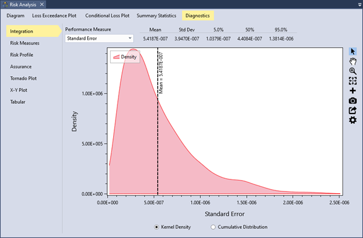
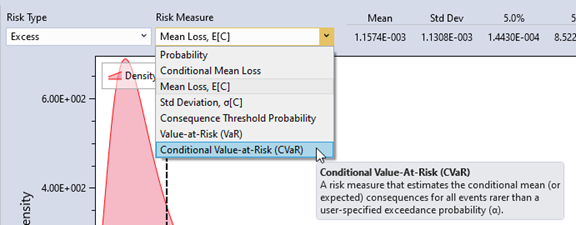
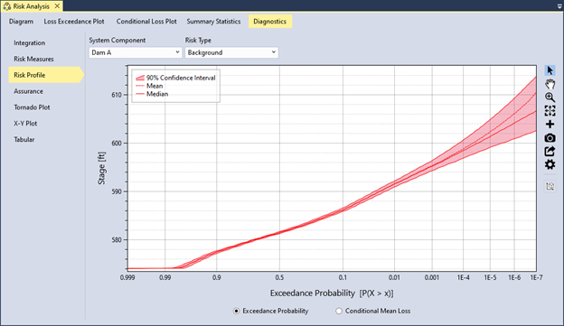
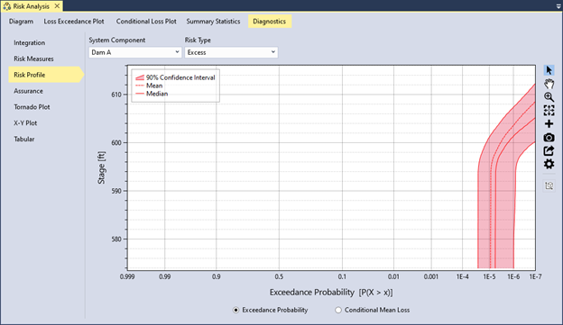
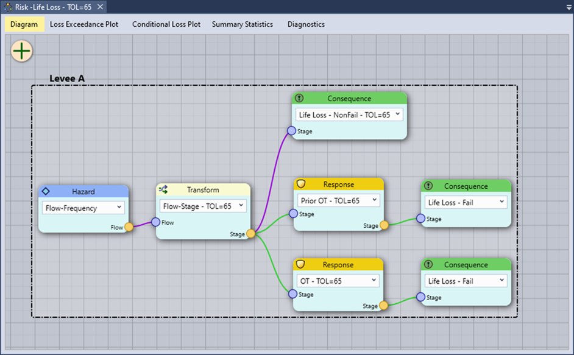
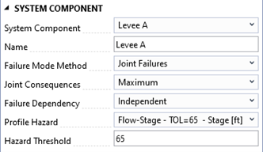
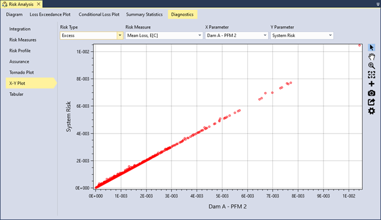
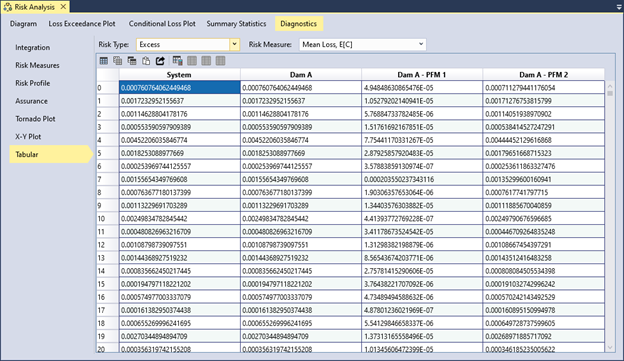
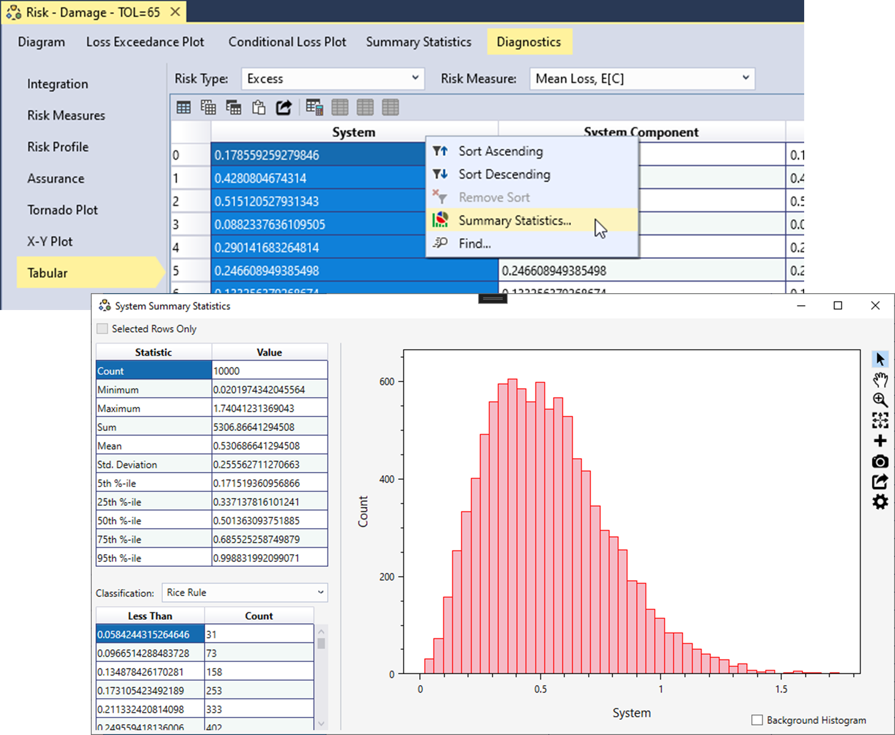

# Risk Analysis Diagnostics

RMC-TotalRisk includes several diagnostic tools to help explore the Monte Carlo simulation results for a risk analysis with full uncertainty. These diagnostics are most useful when the risk analysis inputs include uncertainty. If no uncertainty is defined, the diagnostic tools have limited applicability. The following subsections describe the available risk analysis diagnostics. 

## Integration

The integration diagnostics estimate the standard error of the computed total risk for the system and report the number of integrand function evaluations performed during the risk simulation. These diagnostics are displayed graphically as a kernel density or cumulative distribution plot. A table summarizes key statistics, including the mean, standard deviation, and key percentiles.

Figure \@ref(fig:figure-143) shows an example of the integration diagnostics for the estimated integration standard error during the simulation. In this example, the integration standard error averaged $5.4×10^{-7}$ for each Monte Carlo realization. 

```{r figure-143, echo=FALSE, fig.cap="Example of integration diagnostics.", fig.alt="Displaying standard error as kernel density plot and a tabulation of performance measure of the standard error as mean, standard deviation, and 5th, 50th, and 95th percentiles above the plot. There are radio buttons at the bottom to switch between kernel density or cumulative distribution plot.", fig.align="center"}

```

## Risk Measures

RMC-TotalRisk computes seven risk measures for each of the five risk types:

- **Probability**: Represents the total probability of the risk type. For excess and failure risk, this is the probability of failure. For background and total risk, the probability is 1. For non-failure risk, it is 1 minus the failure probability, which is typically very close to 1.   

- **Conditional Mean Loss**: Represents the mean (or expected) consequences given system failure. The product of probability and conditional mean loss equals the unconditional mean loss, $\mathbb{E}[C]$. This measure is most applicable for excess and failure risk, where the probability of failure is explicitly considered. For background and total risk, the conditional mean equals the unconditional mean.

- **Mean Loss, Ε[C]**: Represents the mean (or expected) consequences, calculated as a probability-weighted average over all hazardous events. In flood damage assessments, this term is commonly called Expected Annual Damage (EAD). In USACE dam and levee safety programs, it is referred to as Average Annual Life Loss (AALL).  

- **Standard Deviation, σ[C]**: Represents the standard deviation of the consequences, which measures deviation from the mean loss. When comparing two risk reduction alternatives with the same mean loss, the option with the smaller standard deviation is considered less risky.

- **Consequence Threshold Probability**: Represents the probability of exceeding a user-specified consequence threshold.

- **Value-at-Risk (VaR)**: Represents the minimum consequences for a user-specified exceedance probability $\alpha$.

- **Conditional Value-at-Risk (CVaR)**: Represents the conditional mean (or expected) consequences for a user-specified exceedance probability $\alpha$. 

For mathematical details on these risk measures, refer to the technical reference manual[@cite-TechRef]. 

As shown in Figure \@ref(fig:figure-144), you can select the desired risk type and risk measure from the dropdown menus to view the results.

```{r figure-144, echo=FALSE, fig.cap="Select the risk type and risk measure to display results.", fig.alt="Window showing Risk Type and Risk Measure dropdowns, with risk measure dropdown clicked displaying all seven risk measures.", fig.align="center"}

```

You can display the distribution as either a kernel density plot or a cumulative distribution plot using the radio buttons at the bottom of the plot. Summary statistics for the distribution appear in the upper right-hand corner (Figure \@ref(fig:figure-145)).

```{r figure-145, echo=FALSE, fig.cap="Risk measure diagnostic tools in RMC-TotalRisk showing the kernel density of the excess mean loss, E[C].", fig.alt="Displaying excess mean loss as kernel density plot and summary statistics of the distribution as mean, standard deviation, and 5th, 50th, and 95th percentiles displayed above the plot. There are radio buttons at the bottom to switch between kernel density or cumulative distribution plot.", fig.align="center"}
knitr::include_graphics("images/figure145.png")
```

## Risk Profile

A **risk profile** plots exceedance probabilities or conditional mean loss against increasing hazard levels. You can filter the risk profile results by system component and risk type. This plot helps identify critical hazard levels where the probability of failure or risk increases sharply. 

Figure \@ref(fig:figure-146) shows the hazard exceedance probability for the background risk at Dam A. Since background risk represents the residual risk from the natural hazard, this risk profile aligns with the input reservoir stage-frequency hazard function. 

```{r figure-146, echo=FALSE, fig.cap="Example of a risk profile plot showing the hazard exceedance probability for the background risk at Dam A.", fig.alt="Plot displaying the hazard exceedance probability for the background risk of Dam A with the 90% confidence interval shown as a red-shaded bound along with median and mean curves. There are radio buttons at the bottom to switch between Exceedance probability or Conditional mean loss plots.", fig.align="center"}

```

Figure \@ref(fig:figure-147) displays the hazard exceedance probability for the excess risk at Dam A. The profile shows an inflection point near a reservoir stage of 595 feet. This inflection occurs because Potential Failure Mode 1 (spillway erosion) has a nonzero probability of failure beginning at this hazard level. At this point, excess risk starts to increase.

```{r figure-147, echo=FALSE, fig.cap="Example of a risk profile plot showing the hazard exceedance probability for the excess risk at Dam A.", fig.alt="Plot displaying the hazard exceedance probability for the Excess risk type of Dam A with the 90% confidence interval shown as a red-shaded bound along with median and mean curves. There are radio buttons at the bottom to switch between Exceedance probability or Conditional mean loss plots.", fig.align="center"}

```

## Assurance

RMC-TotalRisk provides an **assurance** plot and summary statistics based on a user-defined profile hazard type and hazard threshold. This diagnostic supports the National Flood Insurance Program (NFIP) for levees. For more details, refer to the technical reference manual [@cite-TechRef]. 

Figure \@ref(fig:figure-148) illustrates an example risk diagram for a levee risk analysis. The primary hazard is river peak flow frequency, which is transformed into a peak river stage using a flow-to-stage rating curve derived from a hydraulic routing model. Potential Failure Modes (PFMs) include a Prior OT failure mode from backward erosion piping and an OT failure mode. The top of the levee is at a river stage of 65 feet.

```{r figure-148, echo=FALSE, fig.cap="Example risk diagram for a levee risk analysis.", fig.alt="Decorative.", fig.align="center", out.width="95%"}

```

To compute assurance, select the profile hazard type and specify the hazard threshold for the desired system component in the risk analysis options, as shown in Figure \@ref(fig:figure-149).

-	**Profile Hazard**: This option sets the hazard function used to construct risk profiles and estimate the probability of exceeding a hazard threshold. You can select the primary hazard function or any hazard-to-response transform functions. For levee accreditation analyses, use stage or water surface elevation as the profile hazard type.

-	**Hazard Threshold**: This setting defines the hazard level for calculating the probability of exceeding that threshold. The default hazard threshold is 0. For levee accreditation analyses, use the top of levee height or elevation as the hazard threshold.

The assurance diagnostic estimates the uncertainty in the annual probability of inundation (API). The level of assurance (e.g., 85% assurance for levee accreditation) corresponds to the confidence level of the API (e.g., the leveed area is inundated with a probability of 0.01 or less with 85% confidence). To assess assurance using RMC-TotalRisk, simulate the risk analysis with full uncertainty.

```{r figure-149, echo=FALSE, fig.cap="Setting the profile hazard type and threshold level for the system component.", fig.alt="Displays options for selecting system component, name editable by the user, dropdown selections for failure mode method, joint consequences, failure dependency, and profile hazard function, and a text box for entering a hazard threshold value.", fig.align="center"}

```

After completing the risk analysis, navigate to the **Diagnostics** tab and select **Assurance**. The plot includes the following features:

-	The API is plotted on the x-axis, while the non-exceedance probability of API uncertainty is on the y-axis. 

-	The mean API is represented by a vertical dashed blue line.

-	If the assurance level is less than 65%, the target level line is a vertical red line. 

-	For assurance between 65% and 85%, the target level line is orange. 

-	Assurance levels above 85% are indicated by a green line. 

Figure \@ref(fig:figure-150) shows the standard cumulative distribution plot for assurance in the levee risk analysis example. The mean API is 0.00647, and the target level of 0.01 (100-year) has an assurance level of 84.6%, represented by the orange line. Since the assurance level falls between 65% and 85%, the levee accreditation recommendation must be supported by uncertainty analysis, past system performance, and other factors [@cite-ECB2019].

```{r figure-150, echo=FALSE, fig.cap="Example of the cumulative distribution plot for NFIP assurance.", fig.alt="A cumulative distribution plot for Assurance for Levee A for 30-year planning period. A table of summary statistics, including the mean, standard deviation, and key percentiles is provided above the plot. There are radio buttons at the bottom to switch between kernel density or cumulative distribution plot.", fig.align="center"}
knitr::include_graphics("images/figure150.png")
```

## Tornado Plot

A **tornado plot** (Figure \@ref(fig:figure-151)) visually illustrates the sensitivity of risk results to input functions at each hazard level. The plot is based on the selected system component, risk type, sensitivity measure, and hazard level. Inputs are ranked from most sensitive at the top to least sensitive at the bottom. Sensitivity measure options include **Sensitivity Index**, **Pearson’s Correlation**, and **Spearman’s Correlation**. 

Risk sensitivity often varies with hazard level. For instance, at low hazard levels, the results might be most sensitive to uncertainty in the system response, while at higher hazard levels, they may become more sensitive to uncertainty in the hazard probability. You can adjust the hazard level by moving the slider next to the hazard level text box to explore how component sensitivity changes across the range of hazard levels.

```{r figure-151, echo=FALSE, fig.cap="Example of a tornado plot for risk diagnostics.", fig.alt="A tornado plot for the Dam A, Excess Risk Type, Sensitivity Index sensitive measure, and 598 hazard level. The PFM 2 – probability of failure with the highest sensitivity index is plotted on the top, and the PFM 1 – consequences with the lowest sensitivity index is plotted at the bottom.", fig.align="center"}
knitr::include_graphics("images/figure151.png")
```

## X-Y Plot

The **X-Y plot** evaluates the correlation between different system risk components and inputs. You can filter results by risk type, risk measure, X parameter, and Y parameter components. For example, you might set the overall risk of failure at the dam as the Y parameter and the risk of failure from an individual failure mode as the X parameter.

In the dam risk example (Figure \@ref(fig:figure-152)), the X-Y plot reveals a strong correlation between the excess risk of failure mode PFM 2 (concentrated leak erosion) and the excess risk of the overall system. This indicates that significant changes in the PFM 2 failure mode correspond to substantial changes in overall system risk. These findings are consistent with the sensitivity results shown in Figure  \@ref(fig:figure-151).

```{r figure-152, echo=FALSE, fig.cap="Example of a X-Y plot for risk diagnostics.", fig.alt="Decorative.", fig.align="center"}

```

## Tabular 

Tabular results display data based on the selected risk type and risk measure (Figure \@ref(fig:figure-153)). The table includes a column for each system component and a row for each Monte Carlo realization. Use the table column tools to export, copy, or analyze the data.

```{r figure-153, echo=FALSE, fig.cap="Tabular diagnostics tab displays every Monte Carlo realization for the selected risk type and risk measure.", fig.alt="Tabular results for Excess risk type and Mean Loss risk measure displayed for each system component and for each Monte Carlo realization.", fig.align="center"}

```

To analyze a specific column, right-click on the column header and select **Summary Statistics…**. This action generates a histogram plot and detailed summary statistics for the selected column, as shown in Figure \@ref(fig:figure-154). 

```{r figure-154, echo=FALSE, fig.cap="Example of the histogram and summary statistics output for tabular results.", fig.alt="Decorative.", fig.align="center"}

```
